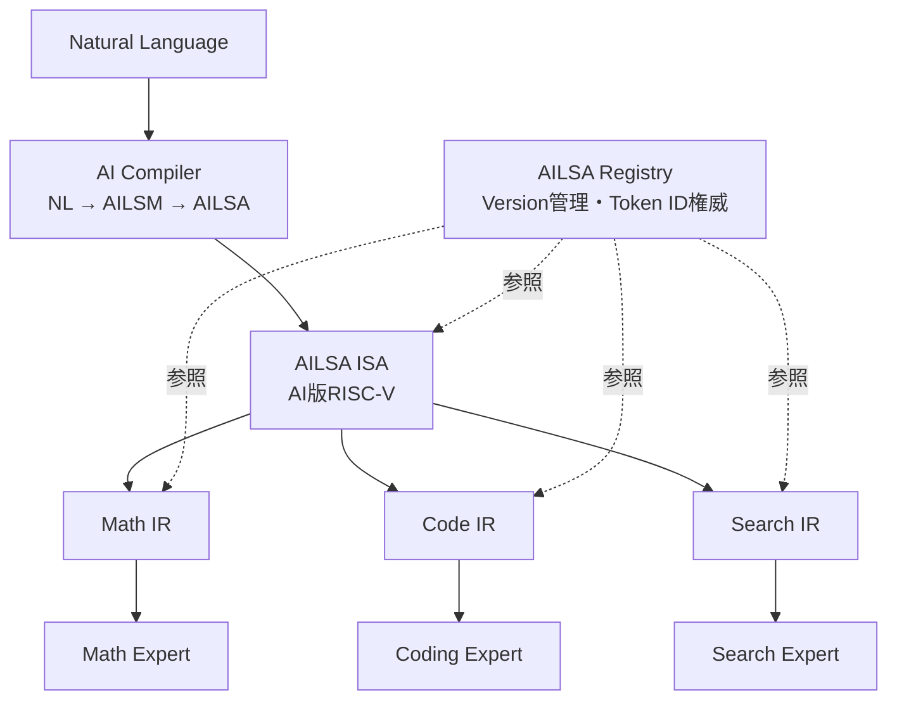

# AILSA ISA Specification

> **AILSA Instruction Set Architecture — AI版RISC-V**
> ArcAsha Inter Language for Small AI models を「言語」ではなく「命令セット」として定義する仕様

| 項目 | 値 |
|------|-----|
| Status | **Draft v0.1** |
| Date | 2026-08-04 |
| 関連文書 | `ARCASHA_V2_SPEC.md`（v2設計）, `PROTOCOL.md`（輸送層）, `NAMING.md`（世界観命名） |

---

## 1. 設計思想：AILSAは言語ではなく命令セット

ARMには `ADD` / `MOV` / `SUB` しかない。しかし **Chrome も Unity も Python も動く**。

AILSAも同じ。基本命令は少ない：

```
CALL   RETURN   STORE   LOAD   FAIL   SUCCESS   PLAN   VERIFY
```

その上に**専門IR**（Math IR / Code IR / Reasoning IR / Search IR）が載る。

| コンピュータ | ArcAsha |
|-------------|---------|
| CPU命令セット（ISA） | **AILSA ISA** |
| 高級IR（LLVM IR） | AILSM（意味グラフ） |
| コンパイラ | Codec（Encoder / Decoder） |
| スケジューラ | ODAR |
| 実行ユニット | Expert |
| メモリ階層 | Memory Expert |
| ベンダー仕様書 | **AILSA Registry** |

これにより ArcAsha の研究テーマは

> 「分散AIをどう作るか」

から

> **「AIのためのコンピュータアーキテクチャをどう設計するか」**

へ引き上げられる。比較対象は「既存のAIフレームワーク」だけでなく、**LLVM や RISC-V のような計算機アーキテクチャ**にも広がる。

---

## 2. 全体像



---

## 3. AILSA Registry（誰が管理するか）

### 3.1 権威（Authority）

- **AILSA Registry は Heart of Wisdom（マスター）が唯一の権威**
- 全Expert・全CodecはRegistryを参照する
- Registryはバージョン管理され、配布される

### 3.2 Registry形式

```
AILSA Registry v1.0

0x04  TASK_SOLVE    [base]    タスク: 求解
0x05  TASK_VERIFY   [base]    タスク: 検証
0x06  TASK_PLAN     [base]    タスク: 計画
0x12  DOMAIN_MATH   [base]    ドメイン: 数学
0x20  SLOT_GOAL     [base]    スロット: 目標
0x30  CALL          [base]    命令: 呼び出し
0x31  RETURN        [base]    命令: 結果返却
0x41  EQ            [math]    数学: 方程式
0x42  DERIVE        [math]    数学: 微分
0x51  FUNCTION      [code]    コード: 関数
0x61  QUERY         [search]  検索: 問い合わせ
```

各エントリは（名前, ID, カテゴリ, 方言, 意味）を持つ。

### 3.3 配布

- マスターに同梱（`src/arcasha/ailsa/registry.json`）
- 必要に応じてノードへ配布（例: `/api/ailsa/registry?v=1.0`）
- アプリ（ippitsu等）に同梱し、オフラインでも参照可能

### 3.4 変更ポリシー（不変則）

- **既存トークンのIDは絶対に変更しない**（`TASK_SOLVE=0x04` が将来 `0x84` になる事故を防ぐ）
- 新トークンは予約領域の空きIDに追加
- 廃止トークンはIDを再利用せず `deprecated` フラグで管理
- これにより配線済みのExpert・保存済みのメモリ・学習済みモデルが壊れない

---

## 4. 命令フォーマット

```
+--------+----------------+---------------------+
| Opcode | Slot（任意）    | Value（長さ前置）     |
| 1 byte | 1 byte         | varint + UTF-8      |
+--------+----------------+---------------------+
```

例：

```
04  12  20  05 'x'   22  0A 'x^2-4=0'
│   │   │   └ len=1 "x"  └ len=10 "x^2-4=0"
│   │   └ SLOT_GOAL
│   └ DOMAIN_MATH
└ TASK_SOLVE
```

- オペコード（Opcode）: 閉じた語彙トークン（命令）
- スロット（Slot）: `SLOT_*`（フィールド識別子）
- 値（Value）: 開いたスロットの内容（数値・短い自然言語・数式文字列）

---

## 5. 命令セット（Base ISA）

### 5.1 制御命令

| ID | 命令 | オペランド | 意味 |
|----|------|-----------|------|
| `0x30` | `CALL` | expert, task_id | エキスパート呼び出し |
| `0x31` | `RETURN` | task_id, result | 結果返却 |
| `0x32` | `STORE` | key, value | 記憶保存 |
| `0x33` | `LOAD` | key | 記憶読み出し |
| `0x34` | `FAIL` | task_id, reason | 失敗通知 |
| `0x35` | `SUCCESS` | task_id | 成功通知 |

### 5.2 思考命令

| ID | 命令 | 意味 |
|----|------|------|
| `0x36` | `PLAN` | プラン生成 |
| `0x37` | `VERIFY` | 検証 |
| `0x38` | `DECOMPOSE` | 分解 |
| `0x39` | `DEPENDENCY` | 依存設定 |
| `0x3A` | `PARALLEL` | 並列実行 |
| `0x3B` | `MERGE` | 統合 |

### 5.3 検索命令

| ID | 命令 | 意味 |
|----|------|------|
| `0x3C` | `SEARCH` | 検索実行 |
| `0x3D` | `RANK` | 順位付け |
| `0x3E` | `FILTER` | フィルタ |

### 5.4 タスク動詞（TASK_*）

| ID | 命令 | 意味 |
|----|------|------|
| `0x04` | `TASK_SOLVE` | 求解 |
| `0x05` | `TASK_VERIFY` | 検証タスク |
| `0x06` | `TASK_PLAN` | 計画タスク |
| `0x07` | `TASK_SEARCH` | 検索タスク |
| `0x08` | `TASK_PATCH` | 修正タスク |
| `0x09` | `TASK_TRANSLATE` | 翻訳タスク |

> この一覧は **Registry v1.0** の一部。権威は常にRegistryであり、本仕様書はその抜粋である。

---

## 6. Dialect（方言）＝ RISC-V の拡張

AILSA全部を全Expertが覚える必要はない。

```
AILSA（Base ISA）
   ↓
Math Dialect / Code Dialect / Search Dialect / Reasoning Dialect
   ↓
各Expert
```

### LLVMとの対応

| LLVM | AILSA |
|------|-------|
| LLVM IR（共通基盤） | AILSA Base ISA |
| x86 ターゲット | Math Dialect |
| ARM ターゲット | Code Dialect |
| RISC-V ターゲット | Search Dialect |

### Dialect一覧

| Dialect | 命令 | 対象Expert |
|---------|------|-----------|
| **Math** | `EQ` `DERIVE` `LIMIT` `MATRIX` `INTEGRAL` | Math Expert |
| **Code** | `FUNCTION` `CLASS` `PATCH` `BUILD` `TEST` | Coding Expert |
| **Search** | `QUERY` `FILTER` `RANK` `EXTRACT` | Search Expert |
| **Reasoning** | `CAUSE` `GOAL` `PLAN` `VERIFY` | Reasoning Expert |

---

## 7. 専門IR（AILSA ISA の上で動く）

専門IRは「**AILSA ISAのサブセット**」。

```
Math IR    = Base ISA + Math Dialect
Code IR    = Base ISA + Code Dialect
Search IR  = Base ISA + Search Dialect
Reasoning IR = Base ISA + Reasoning Dialect
```

各Expertは自分のDialectの命令だけを実装すればよい。Base ISAは全Expertが共通に処理できる。

---

## 8. Versioning

### 8.1 Registryバージョン

- 形式: `MAJOR.MINOR`
- **MINOR更新**: 新トークンの追加（後方互換）
- **MAJOR更新**: 原則禁止。ID変更・削除が必要な場合のみ（実質的に発生させない設計）

### 8.2 独立更新

```
AILSA 1.0 → 1.1        Codec だけ更新
Math IR v1              Expert はそのまま動く
```

- **Codec** は Registry の最新バージョンに対応
- **Expert** は自分の Dialect のバージョンだけ確認すればよい
- 古い Expert も Base ISA サブセットで動き続ける（後方互換）

### 8.3 Expert が知るべきこと

Expert は次の2つだけを見ればよい：

1. Registry の `Version`（例: `1.0`）
2. 自分の `Dialect`（例: `math/v1`）

---

## 9. コンピュータアーキテクチャとしての ArcAsha

| 層 | ArcAsha | コンピュータ |
|----|---------|-------------|
| 命令セット | **AILSA ISA** | 命令セット（RISC-V） |
| 中間表現 | AILSM | 高級IR（LLVM IR） |
| コンパイラ | Codec | コンパイラ |
| スケジューラ | ODAR | OSスケジューラ |
| 実行ユニット | Expert | CPUコア |
| 仕様書 | AILSA Registry | ベンダー仕様書 |
| メモリ | Memory Expert | メモリ階層 |

研究テーマは「**AIのためのコンピュータアーキテクチャ**」に引き上げられ、LLVM / RISC-V との比較が可能になる。

---

## 10. 実装（Phase 0 と並行）

Phase 0 の `vocab.ts` は、本仕様書の **Registry v1.0** をそのままTypeScriptに落としたもの。

| 成果物 | 内容 |
|--------|------|
| `src/arcasha/ailsa/registry.json` | Registry v1.0 の機械可読版（唯一の権威） |
| `src/arcasha/ailsa/vocab.ts` | 語彙→ID の定数（TypeScript） |
| `src/arcasha/ailsa/codec.ts` | 命令のエンコード / デコード（Phase 0.5 で実装） |

---

*この仕様書は、ArcAsha の最も重要な技術資産の一つになる。*
