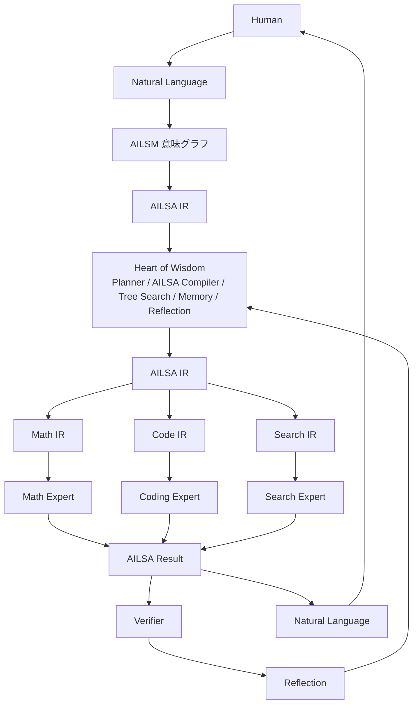
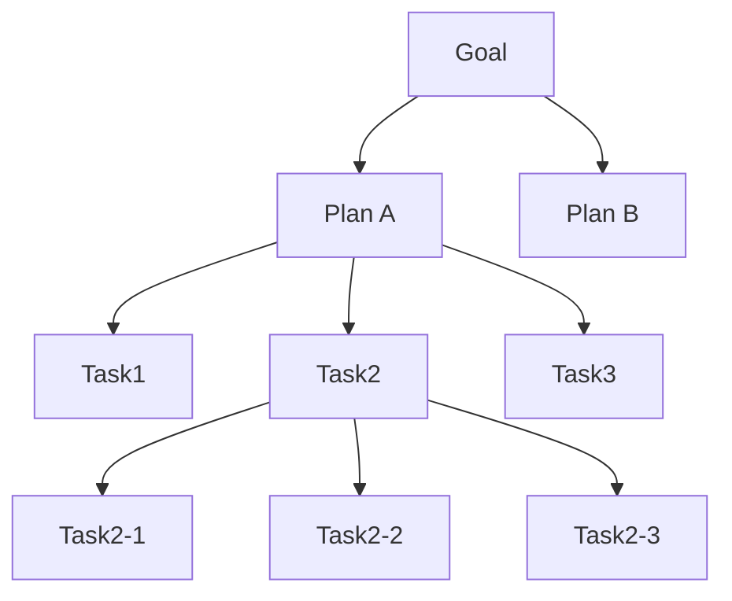

# ArcAsha v2 Design Specification

> **ArcAsha Inter Language for Small AI models**
> 分散された小型AIが「どう考え、どう会話するか」を定義する設計仕様

| 項目 | 値 |
|------|-----|
| Status | **Draft v0.3** |
| Date | 2026-08-04 |
| Owner | ArcAsha Core Team |
| 関連文書 | `MASTER_SPEC.md`（v1 全体像）, `PROTOCOL.md`（バイナリ配線）, `NAMING.md`（世界観命名）, `AILSA_ISA.md`（命令セット仕様） |

---

## 0. 思想の転換：v1 → v2

**v1 の問い**は

> 「LLMをどう繋ぐか」

でした。ノードの発見・接続・推論委譲が中心で、モデル間のやり取りは自然言語（人間言語）のまま渡されていました。

**v2 の問い**は

> 「AIがどう考え、どう会話するか」

に変わります。自然言語は**入口と出口だけ**。内部の協調はすべてAI専用の中間表現で行われます。

```
人間 ──自然言語──▶ [入口] ──AILSA──▶ ファブリック内部 ──AILSA──▶ [出口] ──自然言語──▶ 人間
```

これは既存研究（GPT / Qwen / Gemma / Llama の「自然言語をそのままやり取りする」前提）に対する差別化であり、**ArcAsha最大の特徴**になり得ます。

### v2 の3層構造

| 層 | 構成要素 | 問い |
|----|---------|------|
| **Layer 1: Communication（通信）** | AILSA / AILSM / Expert Message / Relay | 「何を伝えるか」 |
| **Layer 2: Reasoning（思考）** | Hierarchical Reasoning / Tree Search / Reflection | 「どう考えるか」 |
| **Layer 3: Execution（実行）** | ODAR / Expert Calling / Belief / Memory | 「誰に任せるか」 |

この3層は互いに補完し合い、それぞれが独立した研究テーマになり得ます。

### v2 の本質：AI Compiler

AILSAは「AI共通言語」ではなく、**AI専用中間表現（IR）**である。人間のコンパイラスタックに例えると：

| 人間のコンパイラ | ArcAsha v2 |
|----------------|-----------|
| ソースコード | 自然言語 |
| 高級IR（LLVM IR） | AILSM（意味グラフ） |
| 低級IR / アセンブリ | AILSA（Token ID列） |
| ターゲットバックエンド | 専門IR（AILSA-M / AILSA-C / AILSA-S ...） |
| 実行ユニット | 小型Expertモデル |

つまり ArcAsha v2 は **「AIのコンパイラ」** である。LLVMが様々なCPUアーキテクチャを対象にするように、様々な小型AIを対象にした中間表現と最適化基盤を提供する。これが「AIオーケストレーション」から「**AIコンピュータアーキテクチャ**」への進化の本質。

さらに **v2.1** では AILSA を「言語」ではなく**命令セット（ISA: Instruction Set Architecture）**として定義する。AI版RISC-Vとして、基本命令は少なく（CALL / RETURN / STORE / LOAD / FAIL / SUCCESS / PLAN / VERIFY ...）、その上に専門IR（Math IR / Code IR / Search IR）が載る。管理・バージョン・方言は **`AILSA_ISA.md`** に独立仕様として分離する。

| コンピュータ | ArcAsha |
|-------------|---------|
| 命令セット（ISA） | **AILSA ISA** |
| 高級IR（LLVM IR） | AILSM |
| コンパイラ | Codec |
| スケジューラ | ODAR |
| 実行ユニット | Expert |
| ベンダー仕様書 | **AILSA Registry** |

---

## 1. 全体アーキテクチャ



**不変条件**: 内部の意味は一度も自然言語に戻らない。最終結果だけが出口で自然言語へ戻る。

---

## 2. Layer 1: Communication（通信）

### 2.1 AILSA — ArcAsha Inter Language for **Small AI models**

> AI同士だけが話す共通言語。人間は一切見ない。

#### 設計原則（最重要）

AILSAは**トークナイザーではない**。小型AI同士が意味をやり取りするための**中間表現（IR: Intermediate Representation）**である。

そして AILSA は次の2つで構成される：

1. **閉じた語彙（Closed Vocabulary）**: 約100〜300語のプリミティブトークン（enum として固定）
2. **開いたスロット（Open Slots）**: 値だけを入れる自由領域（数値・短い自然言語・数式文字列）

```
TASK {
  goal:     "solve for x",   ← 開いたスロット（内容は自由）
  domain:   math,            ← 閉じた語彙（enum）
  difficulty: 4,             ← 数値スロット
  input:    "x^2 - 4 = 0",   ← 開いたスロット
  dependency: none,          ← 閉じた語彙（enum）
}
```

**なぜ閉じた語彙+開いたスロットなのか**

- **検証可能**：閉じた語彙は厳密パーサーで検証でき、「生成→検証→修復」ループに載せられる
- **小型モデルでも学習・生成しやすい**：JSONツール呼び出し形式と同型であり、Qwen2.5-1.5B クラスでもプロンプトで出せ、ファインチューニングで完全固定できる
- **バイナリ化できる**：閉じた語彙は固定IDに写像でき、既存のバイナリ配線プロトコル（Knowledge Edict）と整合する
- **学習効率が激増**：同じ意味は常に同じ表現（正準化）になるため、「Solve x+2=5.」も「x+2=5を解け」も「Find x.」も全て `TASK_SOLVE EQ_LINEAR VAR_X` に写像され、多様な自然言語表現を個別に学習する必要がなくなる

#### 基本構造（入力側）

| フィールド | 種別 | 説明 |
|-----------|------|------|
| `TASK` | enum | タスク種別（SOLVE / PLAN / VERIFY / PATCH / SEARCH ...） |
| `GOAL` | 開いたスロット | 達成すべき目標 |
| `INPUT` | 開いたスロット | 入力（式・コード・参照ID） |
| `CONSTRAINT` | 開いたスロット | 制約条件 |
| `CONTEXT` | 開いたスロット | 参照コンテキスト |
| `DEPENDENCY` | enum/ID | 依存タスク（なし=none） |
| `OUTPUT` | スキーマ | 期待出力の形式 |
| `CONFIDENCE` | 数値 | 要求される最小確信度 |

#### 基本構造（出力側）

| フィールド | 種別 | 説明 |
|-----------|------|------|
| `RESULT` | 開いたスロット | 結果（例: `x=5`） |
| `CONF` | 数値 [0,1] | 確信度 |
| `TRACE` | 閉じた語彙列 | 推論トレース（STEP / ASSUME / VERIFY ...） |
| `NEXT` | enum/ID | 次にすべきこと（VERIFY / MERGE / CONCLUDE ...） |

#### AILSAトークン（共通）

```
TASK_SOLVE   TASK_VERIFY   TASK_PLAN   TASK_PATCH   TASK_SEARCH
CALL         RETURN        FAIL        PASS
STORE        LOAD          SEARCH      MERGE
```

#### 専門IRトークン（エキスパート方言）

| 方言 | 対象 | トークン例 |
|------|------|-----------|
| **AILSA-M** | Math Expert | `ADD` `MATRIX` `LIMIT` `DERIVATIVE` `INTEGRAL` `EQUATION` |
| **AILSA-C** | Coding Expert | `FUNCTION` `CLASS` `PATCH` `TEST` `REF` `BUG` |
| **AILSA-R** | Reasoning Expert | `CAUSE` `GOAL` `PLAN` `VERIFY` |
| **AILSA-S** | Search Expert | `QUERY` `RANK` `EXTRACT` |

**専門家ごとにIRが異なる**ことが設計の核心。共通AILSAは「翻訳・中継」のための言語であり、各エキスパートは自ドメインのIRで最も効率よく推論する。

#### Token ID 化（AI用アセンブリ言語）

最終形は人間可読な名前ではなく**固定Token ID**。閉じた語彙の各トークンに一意のIDを割り当て、AILSAそのものを**AI用アセンブリ言語**にする。

Token ID の割当は **AILSA Registry**（`AILSA_ISA.md` で仕様化）が唯一の権威を持つ。Registryは Heart of Wisdom（マスター）が管理し、バージョン付きで配布される。

| 範囲 | カテゴリ | 例 |
|------|---------|-----|
| `0x01–0x0F` | タスク動詞 | `TASK_SOLVE=0x04` `TASK_VERIFY=0x05` `TASK_PLAN=0x06` `TASK_SEARCH` `TASK_PATCH` `TASK_TRANSLATE` |
| `0x10–0x1F` | ドメイン | `DOMAIN_MATH=0x12` `DOMAIN_CODE` `DOMAIN_SEARCH` |
| `0x20–0x2F` | スロット（フィールド） | `SLOT_GOAL` `SLOT_INPUT` `SLOT_OUTPUT` `SLOT_CONF` `SLOT_NEXT` `SLOT_CONSTRAINT` |
| `0x30–0x3F` | 制御 | `CALL` `RETURN` `FAIL` `PASS` `MERGE` `PARALLEL` |
| `0x40–0x4F` | AILSA-M（Math） | `EQ` `DERIVE` `LIMIT` `MATRIX` `INTEGRAL` |
| `0x50–0x5F` | AILSA-C（Code） | `FUNCTION` `CLASS` `PATCH` `BUILD` `TEST` |
| `0x60–0x6F` | AILSA-S（Search） | `QUERY` `FILTER` `RANK` `EXTRACT` |
| `0x70–0x7F` | AILSA-R（Reasoning） | `CAUSE` `PLAN` `VERIFY` |

開いたスロットの値は**長さ前置（varint + UTF-8）**で続く。

```
04 12 20 05 'x' 22 ...        TASK_SOLVE DOMAIN_MATH SLOT_GOAL len=1 "x" ...
```

- 意味がバイト列そのものになり、機械が直接処理できる
- 人間の可読性は不要（デバッグ用の逆引きテーブルを別途用意）
- エキスパートは自分が処理する**範囲のToken IDだけ**を理解すればよい（§4.2）

#### バイナリ写像（Knowledge Edict との関係）

AILSAは**意味層**であり、既存の `PROTOCOL.md`（Knowledge Edict）は**輸送層**である。両者は直交する。

```
AILSA（意味層）: 閉じた語彙トークン + 開いたスロット
    ↓ シリアライズ（語彙ID→u16、スロット→可変長）
Knowledge Edict（輸送層）: 既存の48バイトヘッダ + ペイロード
```

- 閉じた語彙 → 固定ID（u16）に写像
- 開いたスロット → 可変長（UTF-8）
- これによりデータプレーンでJSON禁止の原則を守りつつ、意味を運べる

### 2.2 AILSM — ArcAsha Inter Language **Semantic Model**

> AILSAは**言語**。AILSMは**意味モデル**。

自然言語を意味グラフ（Semantic Graph）に構造化したもの。

```
Question
 ├── Goal
 ├── Constraints
 ├── Entities
 ├── Operations
 └── Expected Output
```

AILSMの変換は**ParserではなくCodec（双方向）**として実装する。

```
Encoder:  Natural Language → AILSM → AILSA Token
Decoder:  AILSA Token      → AILSM → Natural Language
```

- **Encoder**（コンパイラのフロントエンド）: 自然言語を意味グラフに正規化し、AILSAトークン列へ落とす
- **Decoder**（コンパイラのバックエンド）: AILSAトークン列を意味グラフへ戻し、自然言語へ復元する

AILSMは「人間の質問を意味として理解した状態」を保持し、AILSAへ落とすときの**正規化された中間体**。メモリには自然言語ではなくAILSMを保存する（§6）。

### 2.3 Expert Message（通信内容の固定）

ノード間・マスター経由のメッセージは固定スキーマ。

```
FROM      = 送信エキスパート（enum）
TO        = 宛先エキスパート（enum）
TASK_ID   = タスクID（u64）
INPUT     = AILSA（閉じた語彙+開いたスロット）
RESULT    = AILSA結果
CONF      = 確信度 [0,1]
TRACE     = 推論トレース
```

例：

```
FROM   = Math
TO     = Reasoning
TASK   = 35
RESULT = x=5
CONF   = 0.82
```

### 2.4 Relay（中継）

**直接通信は禁止。必ずMaster（Heart of Wisdom）経由。**

```
AILSA
 ↓
Relay（Master）
 ↓
Math AILSA → Math Expert
 ↓
Relay（Master）
 ↓
AILSA
```

理由：
- ルーティング判断（ODAR）を一箇所に集約
- セキュリティ・監査・トレースの一元化
- エッジノード（iPhone/iPad等）はサーバーソケットを開かない設計と整合

**中継コストの原則**: ホップごとに小型モデルの生成が入るため、
- スキーマ駆動の変換（フィールドマッピング）は**決定的**に
- 生成するのは**内容だけ**（開いたスロットのみ）
- ホップ数を最小化する（プランナーが最短経路を選ぶ）

### 2.5 AILSA Registry（誰が管理するか）

Token ID の割当は**一元管理**され、バージョン付きで配布される。

- **権威**: Heart of Wisdom（マスター）が唯一の権威。`src/arcasha/ailsa/registry.json` に同梱
- **形式**: `Version` + トークン（名前, ID, カテゴリ, 方言, 意味）
- **変更ポリシー（不変則）**:
  - 既存トークンのIDは**絶対に変更しない**（`TASK_SOLVE=0x04` が将来 `0x84` になる事故を防ぐ）
  - 新トークンは予約領域の空きIDへ追加
  - 廃止トークンはIDを再利用せず deprecated フラグで管理
- **配布**: マスター同梱 + ノードへ配布可能（アプリ同梱でオフラインでも参照可）

### 2.6 Dialect と Versioning

AILSA全部を全Expertが覚える必要はない。LLVM のターゲット（x86/ARM/RISC-V）と同様に、**Dialect**（方言）で分割する。

```
AILSA（Base ISA）
   ↓
Math Dialect / Code Dialect / Search Dialect / Reasoning Dialect
   ↓
各Expert
```

- **Base ISA**: CALL / RETURN / STORE / LOAD / FAIL / SUCCESS / PLAN / VERIFY ... （全Expert必須）
- **Dialect**: Math（EQ DERIVE LIMIT MATRIX）/ Code（FUNCTION CLASS PATCH BUILD）/ Search（QUERY FILTER RANK）...

**Versioning**:
- Registry は `MAJOR.MINOR`。MINOR=追加（後方互換）、MAJOR=原則禁止
- `AILSA 1.0 → 1.1` のとき **Codecだけ更新**。Expert は自分の Dialect のバージョン（例: math/v1）のまま動き続ける
- Expert が知るべきことは「Registry の Version」と「自分の Dialect」だけ

詳細は `AILSA_ISA.md`（命令セット仕様書）を参照。

---

## 3. Layer 2: Reasoning（思考）

### 3.1 Hierarchical Reasoning（木構造による問題分解）

推論は**木**になる。



**どこまで分解するか = Beliefが低いところまで。**

```
Confidence が低い
   ↓
さらに分解
```

確信度の低いタスクは、分解して各サブタスクを別エキスパートに任せ、確信度が上がったら統合する。

### 3.2 Reasoning Unit（木のノード）

各ノードはこれだけを持つ：

```
Reason ID   : ノード固有ID
Parent      : 親ノードID
Goal        : このノードの目標
Input       : AILSA入力
Output      : AILSA出力
Belief      : 達成確信度 [0,1]
Verifier    : 検証結果（PASS/FAIL）
Children    : 子ノード列
```

### 3.3 Tree Search（プラン探索）

Plannerはプラン空間を木探索で探索する。評価は Belief（+ 期待コスト）で行い、ベストプランを選択して Execute する。分解・並列化・統合は明示的に表現する：

```
DECOMPOSE   分解
DEPENDENCY  依存関係
PARALLEL    並列実行
MERGE       統合
```

### 3.4 Reflection（自己修正）

ReflectionもAILSAだけを使う。

```
FAILURE
 ↓
Diagnosis（原因診断）
 ↓
New Plan（新プラン）
 ↓
Execute
```

```
FAILURE { task: 35, cause: precision, conf: 0.3 }
DIAGNOSIS { cause: "numerical instability", fix: "switch backend" }
REPLAN { strategy: "shadow+verify", expert: math, backend: fp64 }
```

---

## 4. Layer 3: Execution（実行）

### 4.1 Expert Calling（ODAR）

**普通のMoEより賢い選択をする。**

MoE: `Gate → Top2` だけ。

ArcAsha v2 は**複数シグナル**で選択する：

```
Belief   （タスクを解ける確信度の推定）
Capability（能力ベクトル — coding/math/general）
Latency  （応答時間予測）
Cost     （計算・エネルギーコスト）
Memory   （利用可能メモリ）
Context  （コンテキスト適合度）
   ↓
LinUCB  （バンディットアルゴリズムで探索・活用の均衡）
   ↓
Expert
```

さらに実行時には：

```
Top1（主実行）
  + Shadow（独立バックエンドで複製実行）
  + Verifier（照合）
```

を回し、**Exact Shadow**（同一モデル+バックエンド+精度 → トークン一致検証）と**Independent Shadow**（異なるバックエンド → 意味検証）を使い分ける。

### 4.2 Expert の種類（初期9種）

| # | Expert | 方言 | 役割 |
|---|--------|------|------|
| 1 | Planning Expert | AILSA | 分解・プラン生成 |
| 2 | Math Expert | AILSA-M | 数式・計算 |
| 3 | Coding Expert | AILSA-C | コード生成・パッチ |
| 4 | Search Expert | AILSA-S | 検索・抽出 |
| 5 | Memory Expert | — | 記憶の保存・想起 |
| 6 | Reasoning Expert | AILSA-R | 推論・因果 |
| 7 | Verification Expert | — | 結果検証（PASS/FAIL） |
| 8 | Translation Expert | — | 自然言語 ⇄ AILSM/AILSA |
| 9 | Vision Expert | AILSA-V | 画像入力（将来） |

#### エキスパートは自然言語を見ない

各エキスパートは自ドメインの**専門IRだけ**を処理する。自然言語能力は不要。

```
Math Expert が見るもの:
04 12 20 05 'x' 22 ...     TASK_SOLVE DOMAIN_MATH SLOT_GOAL len=1 "x" ...

（従来: 「x+2=5を解け」「Solve x+2=5.」「Find x.」を全て学習する必要があった）
```

- **語彙が激減** → トークナイザ・モデルサイズを縮小できる
- **学習データが激減** → 同じ意味は常に同じToken ID列（正準化）なので、学習効率が向上（§6 の H5）

### 4.3 Memory（記憶）

**保存するもの**（自然言語は保存しない）：

```
AILSM        意味グラフ
Reason Tree  推論木
Belief       確信度
Verifier     検証結果
Reward       報酬（学習用）
```

- 会話履歴もAILSMとして保存
- Memory Expert が `STORE` / `LOAD` で応答
- 経験はLinUCBの報酬学習に再利用

---

## 5. 設計原則（まとめ）

1. **意味が自然言語に戻らない** — 内部は常にAILSA/AILSM
2. **閉じた語彙 + 開いたスロット** — 検証可能・学習容易・バイナリ化可能
3. **決定的変換、生成の最小化** — Relayはスキーマ駆動で決定的に、生成は内容のみ
4. **Master経由の中継** — 直接通信禁止、ルーティングと監査を一元化
5. **Belief駆動の分解** — 確信度が低いところだけさらに分解
6. **検証の常設** — Top1 + Shadow + Verifier は常に回す
7. **記憶は意味で保存** — 自然言語は保存しない
8. **同一意味は同一表現（正準化）** — 多様な自然言語表現を一つのToken ID列に写像し、学習・検証・記憶を効率化
9. **エキスパートは専門IRのみ** — 自然言語能力を要求しない（小型化・省リソース）

---

## 6. 研究検証計画

### 6.1 検証すべき命題（研究仮説）

- **H1**: 小型モデル間の協調は、自然言語中継よりAILSA中継の方が**意味ドリフトが小さい**
- **H2**: 小型モデルはAILSA（閉じた語彙+開いたスロット）を生成・消費できる（プロンプト → ファインチューニングで固定）
- **H3**: Belief駆動の階層分解は、単一パス推論より複合タスクで精度が高い
- **H4**: LinUCBによるExpert選択は、固定ルーティングより累積報酬が高い
- **H5**: 専門IRのみを処理する小型モデルは、自然言語を処理する同規模モデルより**タスク精度/パラメータ比**で高効率である

### 6.2 セマンティックドリフト実験（最も説得力のある実験）

```
NL → モデルA → NL → モデルB → NL     （伝言ゲーム = ベースライン）
vs
NL → AILSA → モデルA → AILSA → モデルB → NL   （AILSA）
```

- ホップ数ごとに**入力意味と出力意味の埋め込み類似度**を測定
- AILSA側のドリフトが小さいことを示す
- 既存の `experiments/EXP-XXXX` フレームワークにそのまま載せられる

### 6.3 関連研究（ポジショニング）

| 既存研究 | 関係 |
|---------|------|
| Tool / function calling（JSONスキーマ） | 近縁・実証済みの基盤 |
| PAL（Program-Aided LM） | 推論をプログラム言語に外注する前例 |
| CAMEL / AutoGen / ChatDev | エージェント間通信の前例 |
| LLM as Planner（PDDL出力） | 構造化プランニングの前例 |
| MoE（Gate+Top2） | Expert選択の比較対象 |

**差別化点**: 既存研究が「単一モデル内 or 少数エージェント」であるのに対し、AILSAは「**分散された小型モデル群が共通IRで協調する**」点で、規模と分散性で差が出せる。

さらにAILSAは単なる通信形式ではなく、**AIコンパイラの中間表現**として位置づけられる。LLVMがCPUアーキテクチャの差異を吸収するように、AILSA/AILSMはモデル・バックエンド・精度の差異を吸収し、「**専門IRを処理する小型モデル群**」という新しい学習・推論パラダイムへ接続する。これが「AI共通言語」ではなく「**AI専用IR**」としての本質であり、論文の中心命題になる。

### 6.4 論文3本立て（将来）

1. **Paper 1: ODAR** — Observation-Driven Adaptive Routing（誰に任せるか）
2. **Paper 2: AILSA / AILSM** — Intermediate Language for Small AI models（何をどう伝えるか）
3. **Paper 3: ArcAsha** — Belief-Driven Distributed AI Orchestration（統合）

---

## 7. 実装ロードマップ

| Phase | 内容 | 成果物 | 既存資産の活用 |
|-------|------|--------|---------------|
| **0** | **AILSA Registry v1.0 + Closed Vocabulary**（Token ID 割当表。`AILSA_ISA.md` 準拠） | `src/arcasha/ailsa/`（registry.json, vocab.ts） | — |
| **0.5** | **AILSA Codec**（Encoder: NL→AILSM→Token / Decoder: Token→AILSM→NL） | `src/arcasha/ailsa/`（codec.ts, encoder.ts, decoder.ts） | 小型モデルでEncoder/Decoderをプロンプト実装 |
| **1** | ハブでのAILSAリレー（2ノード間マルチホップ） | 最小デモ（既存 `demo-web.ts` 拡張） | 既存ハブ+実機ノード |
| **2** | AILSM Codec 本実装（意味グラフ ⇄ トークン） | `src/arcasha/ailsm/` | Translation Expert 相当をプロンプトで |
| **3** | Hierarchical Reasoning（Reasoning Unit + Tree Search） | `src/arcasha/reasoning/` | — |
| **4** | Expert Calling（LinUCB + Shadow + Verifier） | `src/arcasha/odar/` | 既存 `src/fault/fault-tolerance.ts` |
| **5** | Memory（AILSM保存 + Memory Expert） | `src/memory/` 拡張 | 既存 `src/memory/store.ts` |
| **6** | Reflection ループ統合 | エンドツーエンド | — |

---

## 8. 命名（NAMING.md への追加候補）

| 世界観名 | 正式名称 | 略称 |
|---------|---------|------|
| **Tongue of Wisdom / 知恵の舌** | ArcAsha Inter Language | **AILSA** |
| **Mirror of Meaning / 意味の鏡** | ArcAsha Inter Language Semantic Model | **AILSM** |
| **Tree of Thought / 思考の樹** | Hierarchical Reasoning | — |
| **Oracle of Choice / 選択の神託** | Expert Calling (ODAR) | — |

> 正式な採用時は `NAMING.md` に追記する。

---

## 9. 用語集

| 用語 | 定義 |
|------|------|
| **AILSA** | AI同士が意味をやり取りする共通中間表現（閉じた語彙+開いたスロット） |
| **AILSM** | 自然言語を意味グラフ化した意味モデル（AILSAの前段） |
| **AILSA-M/C/R/S/V** | 各エキスパート専用のIR方言 |
| **Codec** | AILSAとAILSM/自然言語を相互変換する双方向モジュール（Encoder + Decoder） |
| **Token ID** | 閉じた語彙に割り当てた固定ID（0x04=TASK_SOLVE 等）。AILSAをアセンブリ言語化する |
| **AILSA ISA** | AILSAを命令セットとして定義した仕様。AI版RISC-V（`AILSA_ISA.md`） |
| **AILSA Registry** | Token ID割当の権威・バージョン管理（マスターが管理） |
| **Dialect** | エキスパート固有の命令サブセット（Math/Code/Search/Reasoning） |
| **Reasoning Unit** | 推論木のノード（Goal/Input/Output/Belief/Verifier/Children） |
| **Belief** | タスク達成確信度 [0,1]。分解・ルーティング・検証の判断基準 |
| **ODAR** | Observation-Driven Adaptive Routing。Expert選択アルゴリズム |
| **LinUCB** | バンディットによる探索・活用の均衡アルゴリズム |
| **Shadow** | 検証用の複製実行（Exact / Independent の2種） |
| **Relay** | Master経由のAILSA中継。直接通信は禁止 |

---

## 10. 未来展望：ArcAsha v3（専門IRネイティブ）

```
Human → Natural Language → AILSM → AILSA → Math IR → Math Model
```

v2 では自然言語入力をAILSAへ変換し、既存の（自然言語を理解する）モデルへ渡す。**v3** では、各エキスパートが最初から**専門IRを直接処理する小型モデル**として生まれ変わる。

- Math: `EQ` `DERIVE` `LIMIT` `MATRIX` だけ
- Coding: `FUNCTION` `CLASS` `PATCH` `BUILD` だけ
- Search: `QUERY` `FILTER` `RANK` だけ

この段階で ArcAsha は「自然言語を理解するLLM」から「**専門IRを処理する小型モデル群**」の分散基盤へ完全移行する。

**ArcAsha v3 の3本柱**：

| 柱 | 役割 | 問い |
|----|------|------|
| **AILSA** | AI間通信プロトコル | 何を伝えるか |
| **ODAR** | 適応型ルーティング | 誰に任せるか |
| **専門IR + 小型Expert** | 高効率な分散推論 | 何を考えるか |

これはArcAshaの中で最も大きく発展する可能性を秘めた部分であり、研究としての独自性の核心。

---

*この仕様書が、今後の実装ロードマップと将来の論文の土台となる。*
