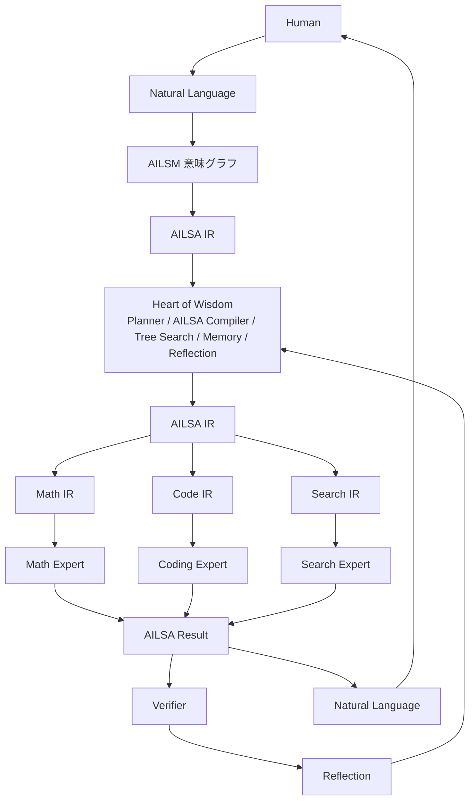
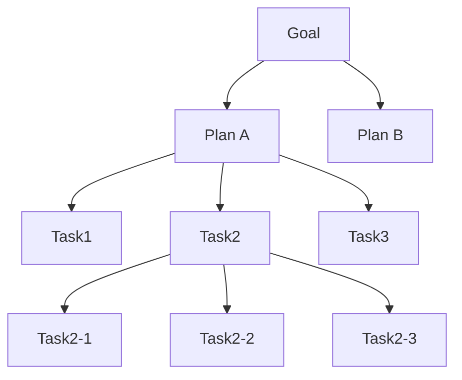

# ArcAsha v2 Design Specification

> **ArcAsha Inter Language for Small AI models**
> 分散された小型AIが「どう考え、どう会話するか」を定義する設計仕様

| 項目 | 値 |
|------|-----|
| Status | **Draft v0.36（v1.1: Decision Replay / 実機プラン）** |
| Date | 2026-08-06 |
| Owner | ArcAsha Core Team |
| 関連文書 | `MASTER_SPEC.md`（v1 全体像）, `PROTOCOL.md`（バイナリ配線）, `NAMING.md`（世界観命名）, `AILSA_ISA.md`（命令セット仕様）, `AILSM_IR.md`（中間表現仕様）, `AILSM_COMPILER.md`（コンパイラ仕様）, `AILSA_RUNTIME.md`（実行基盤仕様）, `AI_TOOLCHAIN.md`（ツールチェーン仕様）, `AI_ABI.md`（ABI/Driver/DeviceTree 仕様）, `AI_VIRTUAL_MEMORY.md`（AVM 仕様）, `AI_OBSERVABILITY.md`（計測器仕様）, `AI_RUNTIME_PHASE1.md`（実機実行系）, `AI_EVALUATION.md`（評価）, `AI_REASONING.md`（Reasoning Runtime）, `AI_ATTACHMENTS.md`（プラグイン層）, `AI_VALIDATION.md`（再現可能な評価） |

---

## 0. 思想の転換：v1 → v2

**v1 の問い**は

> 「LLMをどう繋ぐか」

でした。ノードの発見・接続・推論委譲が中心で、モデル間のやり取りは自然言語（人間言語）のまま渡されていました。

**v2 の問い**は

> 「AIがどう考え、どう会話するか」

に変わります。自然言語は**入口と出口だけ**。内部の協調はすべてAI専用の中間表現で行われます。

```
人間 ──自然言語──▶ [入口] ──AILSA──▶ ファブリック内部 ──AILSA──▶ [出口] ──自然言語──▶ 人間
```

これは既存研究（GPT / Qwen / Gemma / Llama の「自然言語をそのままやり取りする」前提）に対する差別化であり、**ArcAsha最大の特徴**になり得ます。

### v2 の3層構造

| 層 | 構成要素 | 問い |
|----|---------|------|
| **Layer 1: Communication（通信）** | AILSA / AILSM / Expert Message / Relay | 「何を伝えるか」 |
| **Layer 2: Reasoning（思考）** | Hierarchical Reasoning / Tree Search / Reflection | 「どう考えるか」 |
| **Layer 3: Execution（実行）** | ODAR / Expert Calling / Belief / Memory | 「誰に任せるか」 |

この3層は互いに補完し合い、それぞれが独立した研究テーマになり得ます。

### v2 の本質：AI Compiler

AILSAは「AI共通言語」ではなく、**AI専用中間表現（IR）**である。人間のコンパイラスタックに例えると：

| 人間のコンパイラ | ArcAsha v2 |
|----------------|-----------|
| ソースコード | 自然言語 |
| 高級IR（LLVM IR） | AILSM（意味グラフ） |
| 低級IR / アセンブリ | AILSA（Token ID列） |
| ターゲットバックエンド | 専門IR（AILSA-M / AILSA-C / AILSA-S ...） |
| 実行ユニット | 小型Expertモデル |

つまり ArcAsha v2 は **「AIのコンパイラ」** である。LLVMが様々なCPUアーキテクチャを対象にするように、様々な小型AIを対象にした中間表現と最適化基盤を提供する。これが「AIオーケストレーション」から「**AIコンピュータアーキテクチャ**」への進化の本質。

さらに **v2.1** では AILSA を「言語」ではなく**命令セット（ISA: Instruction Set Architecture）**として定義する。AI版RISC-Vとして、基本命令は少なく（CALL / RETURN / STORE / LOAD / FAIL / SUCCESS / PLAN / VERIFY ...）、その上に専門IR（Math IR / Code IR / Search IR）が載る。管理・バージョン・方言は **`AILSA_ISA.md`** に独立仕様として分離する。

| コンピュータ | ArcAsha |
|-------------|---------|
| 命令セット（ISA） | **AILSA ISA** |
| 高級IR（LLVM IR） | AILSM |
| コンパイラ | Codec |
| スケジューラ | ODAR |
| 実行ユニット | Expert |
| ベンダー仕様書 | **AILSA Registry** |

---

## 1. 全体アーキテクチャ



**不変条件**: 内部の意味は一度も自然言語に戻らない。最終結果だけが出口で自然言語へ戻る。

### コンパイラ全体像（Front-End / Back-End）

```
Human → Natural Language
        │  ─────────── Front-End Compiler ───────────
        │  Lexer → Parser → Normalizer → Semantic Analyzer → Verifier
        ▼
      AILSM（ID付き意味グラフ = SSA風）
        │  Optimizer（AILSM最適化）
        ▼
      AILSA（命令セット）
        │  ─────────── Back-End Compiler ───────────
        │  Expert IR → Dispatch → ODAR → Scheduler
        ▼
      Experts
        │  Verifier → Reflection → Memory
        ▼
Natural Language → Human
```

**役割分担**（それぞれ独立した研究対象・公開可能なライブラリ単位）:

| コンポーネント | 研究対象 | コンピュータ相当 |
|---------------|---------|-----------------|
| **AILSM** | AI向け意味IR（SSA風・ID付きグラフ） | LLVM IR |
| **AILSA** | AI向け命令セット（ISA） | アセンブリ / RISC-V |
| **Codec** | AIコンパイラ（Front-End + Back-End） | コンパイラ |
| **ODAR** | AIスケジューラ | OSスケジューラ |

### AI Compiler Ecosystem（CompilerもExpertになる）

LLVMがClangと分離されているように、ArcAshaでは**Compilerは基盤と独立した部品**であり、それ自体がExpertになり得る。

```
日本語 → [Front-end Compiler: GPT / Gemini / Claude / Qwen どれでも] → AILSM
AILSM → [Back-end Compiler: Math / Code / Reasoning 別々] → AILSA → Expert
```

- **Front-end Compiler**（NL → AILSM）: 好きなモデルでよい。インターフェース（入力: 自然言語 / 出力: AILSM）が固定され、出力はValidatorで検証される
- **Back-end Compiler**（AILSM → AILSA）: Math Compiler / Code Compiler / Reasoning Compiler とドメイン別に分離可能
- **CompilerもExpertになる**: 既存9種の「Translation Expert」がFront-end相当。各ドメインExpertは自前のBack-end Compilerを持つ
- ODARは**どのCompilerを使うかもルーティング**する（能力・コスト・レイテンシで選択）

| LLVM | ArcAsha |
|------|---------|
| Clang | Front-end Compiler（GPT / Gemini / ...） |
| LLVM | AILSM |
| x86 Back-end | Math Compiler → AILSA → Math Expert |

---

## 2. Layer 1: Communication（通信）

### 2.1 AILSA — ArcAsha Inter Language for **Small AI models**

> AI同士だけが話す共通言語。人間は一切見ない。

#### 設計原則（最重要）

AILSAは**トークナイザーではない**。小型AI同士が意味をやり取りするための**中間表現（IR: Intermediate Representation）**である。

そして AILSA は次の2つで構成される：

1. **閉じた語彙（Closed Vocabulary）**: 約100〜300語のプリミティブトークン（enum として固定）
2. **開いたスロット（Open Slots）**: 値だけを入れる自由領域（数値・短い自然言語・数式文字列）

```
TASK {
  goal:     "solve for x",   ← 開いたスロット（内容は自由）
  domain:   math,            ← 閉じた語彙（enum）
  difficulty: 4,             ← 数値スロット
  input:    "x^2 - 4 = 0",   ← 開いたスロット
  dependency: none,          ← 閉じた語彙（enum）
}
```

**なぜ閉じた語彙+開いたスロットなのか**

- **検証可能**：閉じた語彙は厳密パーサーで検証でき、「生成→検証→修復」ループに載せられる
- **小型モデルでも学習・生成しやすい**：JSONツール呼び出し形式と同型であり、Qwen2.5-1.5B クラスでもプロンプトで出せ、ファインチューニングで完全固定できる
- **バイナリ化できる**：閉じた語彙は固定IDに写像でき、既存のバイナリ配線プロトコル（Knowledge Edict）と整合する
- **学習効率が激増**：同じ意味は常に同じ表現（正準化）になるため、「Solve x+2=5.」も「x+2=5を解け」も「Find x.」も全て `TASK_SOLVE EQ_LINEAR VAR_X` に写像され、多様な自然言語表現を個別に学習する必要がなくなる

#### 基本構造（入力側）

| フィールド | 種別 | 説明 |
|-----------|------|------|
| `TASK` | enum | タスク種別（SOLVE / PLAN / VERIFY / PATCH / SEARCH ...） |
| `GOAL` | 開いたスロット | 達成すべき目標 |
| `INPUT` | 開いたスロット | 入力（式・コード・参照ID） |
| `CONSTRAINT` | 開いたスロット | 制約条件 |
| `CONTEXT` | 開いたスロット | 参照コンテキスト |
| `DEPENDENCY` | enum/ID | 依存タスク（なし=none） |
| `OUTPUT` | スキーマ | 期待出力の形式 |
| `CONFIDENCE` | 数値 | 要求される最小確信度 |

#### 基本構造（出力側）

| フィールド | 種別 | 説明 |
|-----------|------|------|
| `RESULT` | 開いたスロット | 結果（例: `x=5`） |
| `CONF` | 数値 [0,1] | 確信度 |
| `TRACE` | 閉じた語彙列 | 推論トレース（STEP / ASSUME / VERIFY ...） |
| `NEXT` | enum/ID | 次にすべきこと（VERIFY / MERGE / CONCLUDE ...） |

#### AILSAトークン（共通）

```
TASK_SOLVE   TASK_VERIFY   TASK_PLAN   TASK_PATCH   TASK_SEARCH
CALL         RETURN        FAIL        PASS
STORE        LOAD          SEARCH      MERGE
```

#### 専門IRトークン（エキスパート方言）

| 方言 | 対象 | トークン例 |
|------|------|-----------|
| **AILSA-M** | Math Expert | `EQ` `DERIVE` `LIMIT` `MATRIX` `INTEGRAL` `ADD` `SUBTRACT` `MULTIPLY` `DIVIDE` `SQRT` `SQUARE` |
| **AILSA-C** | Coding Expert | `FUNCTION` `CLASS` `PATCH` `TEST` `REF` `BUG` |
| **AILSA-R** | Reasoning Expert | `CAUSE` `GOAL` `PLAN` `VERIFY` |
| **AILSA-S** | Search Expert | `QUERY` `RANK` `EXTRACT` |

**専門家ごとにIRが異なる**ことが設計の核心。共通AILSAは「翻訳・中継」のための言語であり、各エキスパートは自ドメインのIRで最も効率よく推論する。

#### Token ID 化（AI用アセンブリ言語）

最終形は人間可読な名前ではなく**固定Token ID**。閉じた語彙の各トークンに一意のIDを割り当て、AILSAそのものを**AI用アセンブリ言語**にする。

Token ID の割当は **AILSA Registry**（`AILSA_ISA.md` で仕様化）が唯一の権威を持つ。Registryはマスターノード（Master）が管理し、バージョン付きで配布される。

| 範囲 | カテゴリ | 例 |
|------|---------|-----|
| `0x01–0x0F` | タスク動詞 | `TASK_SOLVE=0x04` `TASK_VERIFY=0x05` `TASK_PLAN=0x06` `TASK_SEARCH` `TASK_PATCH` `TASK_TRANSLATE` `TASK_SUMMARIZE=0x0A` |
| `0x10–0x1F` | ドメイン | `DOMAIN_MATH=0x12` `DOMAIN_CODE` `DOMAIN_SEARCH` |
| `0x20–0x2F` | スロット（フィールド） | `SLOT_GOAL` `SLOT_INPUT` `SLOT_OUTPUT` `SLOT_CONF` `SLOT_NEXT` `SLOT_CONSTRAINT` |
| `0x30–0x3F` | 制御 | `CALL` `RETURN` `FAIL` `PASS` `MERGE` `PARALLEL` |
| `0x40–0x4F` | AILSA-M（Math） | `EQ` `DERIVE` `LIMIT` `MATRIX` `INTEGRAL` `ADD` `SUBTRACT` `MULTIPLY` `DIVIDE` `SQRT` `SQUARE` |
| `0x50–0x5F` | AILSA-C（Code） | `FUNCTION` `CLASS` `PATCH` `BUILD` `TEST` |
| `0x60–0x6F` | AILSA-S（Search） | `QUERY` `FILTER` `RANK` `EXTRACT` |
| `0x70–0x7F` | AILSA-R（Reasoning） | `CAUSE` `PLAN` `VERIFY` |

開いたスロットの値は**長さ前置（varint + UTF-8）**で続く。

```
04 12 20 05 'x' 22 ...        TASK_SOLVE DOMAIN_MATH SLOT_GOAL len=1 "x" ...
```

- 意味がバイト列そのものになり、機械が直接処理できる
- 人間の可読性は不要（デバッグ用の逆引きテーブルを別途用意）
- エキスパートは自分が処理する**範囲のToken IDだけ**を理解すればよい（§4.2）

#### バイナリ写像（Knowledge Edict との関係）

AILSAは**意味層**であり、既存の `PROTOCOL.md`（Knowledge Edict）は**輸送層**である。両者は直交する。

```
AILSA（意味層）: 閉じた語彙トークン + 開いたスロット
    ↓ シリアライズ（語彙ID→u16、スロット→可変長）
Knowledge Edict（輸送層）: 既存の48バイトヘッダ + ペイロード
```

- 閉じた語彙 → 固定ID（u16）に写像
- 開いたスロット → 可変長（UTF-8）
- これによりデータプレーンでJSON禁止の原則を守りつつ、意味を運べる

### 2.2 AILSM — ArcAsha Inter Language **Semantic Model**

> AILSAは**言語**。AILSMは**意味モデル**。

自然言語を意味グラフ（Semantic Graph）に構造化したもの。

```
Question
 ├── Goal
 ├── Constraints
 ├── Entities
 ├── Operations
 └── Expected Output
```

AILSMは**SSA（Static Single Assignment）風のID付き意味グラフ**として設計する。LLVMでSSAがVerifier・最適化を劇的に簡単にしたのと同じ発想。

```
（素朴なグラフ）                 （SSA風）
Solve                           Task#1
 ├─ Math                         ├─ Domain=Math
 └─ Circle                      Object#1
      └─ Radius=5                ├─ Type=Circle
                                 └─ Value#1
                                      └─ Radius=5
                                Task#1 uses(Object#1)
                                Task#1 uses(Value#1)
```

- 全ノードに**一意ID**（Task#N / Object#N / Value#N）を付与
- 参照はIDで表現（`uses(Object#1)`）
- **Verifierが圧倒的に楽になる**: 同一ノードの同一性がIDで判定でき、文字列比較や言い換え耐性に依存しない

**CodecはCompilerそのものである**。Encoder/Decoderだけでなく、以下のパイプラインで実装する。

```
Lexer → Parser → Normalizer → Semantic Analyzer → Optimizer → AILSA Generator
```

- **Lexer / Parser**: 自然言語をトークン化し、構文構造（AST）へ
- **Normalizer**: 同義語を正準語へ畳み込む（足してください / 加えて / 和を求めよ → `ACTION_ADD`）
- **Semantic Analyzer**: 意味ノード（Task / Object / Value）を抽出しIDを付与
- **Optimizer**: AILSMレベルの最適化（§2.7）
- **AILSA Generator**: AILSM → AILSA命令列（Byte Codec へ）

#### 型システム（Typed AILSM）

SSAの次の進化として**型システム**を導入する。

```
Value#12 : Number
Object#3  : Circle
Task#1    : Solve
```

- **コンパイル時の型エラー検出**: 型が合わない演算・接続をAILSA生成前に検出
- **静的IR検査**: Expertが受け取れるIRを型で静的検査（Math Expert は Number のみ受領、等）
- **Verifierの事前排除**: 実行前に矛盾を排除（型安全性 = プログラミング言語の型安全性をAIシステムへ持ち込む）

AILSMは「人間の質問を意味として理解した状態」を保持し、AILSAへ落とすときの**正規化された中間体**。メモリには自然言語ではなくAILSMを保存する（§6）。

#### 精度保証：3段階 Codec（自然言語 ⇄ AILSM ⇄ AILSA）

AILSA（命令セット）は100%決定論で設計できるが、**入口（自然言語→AILSM）と出口（AILSM→自然言語）だけは解釈が必要**。ここがArcAsha v2で最も研究価値のある部分であり、精度を決めるのはCodecである。

```
Stage1: Deterministic Parser（辞書・規則。100%決定論）
Stage2: LLM残差（辞書で判定できない部分のみ。閉じた語彙に制約）
Stage3: Verifier（往復照合で意味一致率を測定）
```

**Stage 1 — Deterministic Parser**
- 「足し算」「平方根」「積分」等の閉じた語彙要素はLLMを使わず辞書/規則で変換（例: 足す/加える/たす → `ACTION_ADD`）
- 同義語は正準ノードへ折り畳む（Circle / 円 / circle / 円形 → 同一ノード）
- ここは100%決定論であり、golden testで完全に検証する

**Stage 2 — LLM残差（制約付き生成）**
- 辞書で判定できない部分だけをLLMへ投げる（例: 「この文章を要約して」→ `TASK_SUMMARIZE`）
- **閉じた語彙だからこそ**、LLMの出力空間が小さく、Phase 0 の Validator で検証可能
- 「生成→検証→修復」ループ: 不正なら再プロンプト

**Stage 3 — Verifier（往復照合）**
- 元の自然言語 → AILSM → 自然言語 へ戻し、意味一致率を測定
- 測定法: BLEU（参考）/ BERTScore / Sentence Transformer 埋め込みコサイン / **AILSMグラフ一致率**
- 例: 一致率 0.97 → 採用 / 0.55 → AILSM生成失敗として再エンコード
- **優雅な縮退**: Verifierが閾値を下回ったら、AILSA中継を諦めてNL中継へフォールバック（意味を黙って壊さない）

**AILSMグラフ比較の強み**: 文字列ではなく**意味ノード**で比較できる。自然言語へ戻した時に `Circle→円→circle→円形` が全て同一ノードになるため、言い換えに頑健。

**Neural Codec（研究フェーズ）**: 将来的には NL⇄AILSM ペアで専用の小規模モデル（数千万〜数億パラメータ）を学習し、巨大LLMなしで「意味コンパイラ」を動かす。これは巨大モデルを必要としないArcAsha独自のCompiler研究になる。

### 2.3 Expert Message（通信内容の固定）

ノード間・マスター経由のメッセージは固定スキーマ。

```
FROM      = 送信エキスパート（enum）
TO        = 宛先エキスパート（enum）
TASK_ID   = タスクID（u64）
INPUT     = AILSA（閉じた語彙+開いたスロット）
RESULT    = AILSA結果
CONF      = 確信度 [0,1]
TRACE     = 推論トレース
```

例：

```
FROM   = Math
TO     = Reasoning
TASK   = 35
RESULT = x=5
CONF   = 0.82
```

### 2.4 Relay（中継）

**直接通信は禁止。必ずマスターノード（Master）経由。**

```
AILSA
 ↓
Relay（Master）
 ↓
Math AILSA → Math Expert
 ↓
Relay（Master）
 ↓
AILSA
```

理由：
- ルーティング判断（ODAR）を一箇所に集約
- セキュリティ・監査・トレースの一元化
- エッジノード（iPhone/iPad等）はサーバーソケットを開かない設計と整合

**中継コストの原則**: ホップごとに小型モデルの生成が入るため、
- スキーマ駆動の変換（フィールドマッピング）は**決定的**に
- 生成するのは**内容だけ**（開いたスロットのみ）
- ホップ数を最小化する（プランナーが最短経路を選ぶ）

### 2.5 AILSA Registry（誰が管理するか）

Token ID の割当は**一元管理**され、バージョン付きで配布される。

- **権威**: マスターノード（Master）が唯一の権威。`src/arcasha/ailsa/registry.json` に同梱
- **形式**: `Version` + トークン（名前, ID, カテゴリ, 方言, 意味）
- **変更ポリシー（不変則）**:
  - 既存トークンのIDは**絶対に変更しない**（`TASK_SOLVE=0x04` が将来 `0x84` になる事故を防ぐ）
  - 新トークンは予約領域の空きIDへ追加
  - 廃止トークンはIDを再利用せず deprecated フラグで管理
- **配布**: マスター同梱 + ノードへ配布可能（アプリ同梱でオフラインでも参照可）

### 2.6 Dialect と Versioning

AILSA全部を全Expertが覚える必要はない。LLVM のターゲット（x86/ARM/RISC-V）と同様に、**Dialect**（方言）で分割する。

```
AILSA（Base ISA）
   ↓
Math Dialect / Code Dialect / Search Dialect / Reasoning Dialect
   ↓
各Expert
```

- **Base ISA**: CALL / RETURN / STORE / LOAD / FAIL / SUCCESS / PLAN / VERIFY ... （全Expert必須）
- **Dialect**: Math（EQ DERIVE LIMIT MATRIX）/ Code（FUNCTION CLASS PATCH BUILD）/ Search（QUERY FILTER RANK）...

**Versioning**:
- Registry は `MAJOR.MINOR`。MINOR=追加（後方互換）、MAJOR=原則禁止
- `AILSA 1.0 → 1.1` のとき **Codecだけ更新**。Expert は自分の Dialect のバージョン（例: math/v1）のまま動き続ける
- Expert が知るべきことは「Registry の Version」と「自分の Dialect」だけ

詳細は `AILSA_ISA.md`（命令セット仕様書）を参照。

### 2.7 AILSM Optimizer（AILSM最適化）

AILSMのまま最適化する（LLVM Passに相当）。

**命令の畳み込み（Batching）**:

```
CALL Math
CALL Math
CALL Math
```

→

```
CALL Math  Batch=3
```

**並べ替え（Reordering）**:

```
検索 → 翻訳 → 検索
```

→

```
検索 → 検索 → 翻訳      （翻訳は最後に1回で済む）
```

- 通信コスト・レイテンシを最小化する
- 決定論ルール（安全な変形のみ）から始め、学習ベースの最適化は研究フェーズ

**Pass Manager 実装（Phase 0.6）**:
- 最適化レベル `-O0..-O3`（LLVM の Optimization Level 相当）
- Pass: DeadNodeElimination（DCE）/ Dedup / ConstantFolding（`2+3 → 5`）/ BatchDetection
- 将来 Pass: DeadExpertElimination / Reordering / Cost-based 選択

---

## 3. Layer 2: Reasoning（思考）

**全サブシステムは同じAILSMグラフを見る（共有IR）**。SSA化により依存関係が全て見える（`Task#1 → Math#2 → Equation#5 → Result#9`）ため、Planner / Tree Search / Reflection / Memory / Verifier / ODAR は全て同じAILSMを読み書きする。これはCPUで「**全員が同じメモリを見る**」のに等しい。従来のように各コンポーネントが自然言語を個別に解釈する（「たぶんこういう意味」）曖昧さが消える。

さらに AILSM は **AI State IR** である — Task / Plan / Belief / Memory / Reflection / Result など**AIの内部状態全体をSSAノードとして管理する実行可能IR**（Phase 0.9）。LLVM IRがCPU状態しか持たないのに対し、AILSMはAIの状態全体を持つ。**AIの思考が全て可視化できる**。

さらに v0.12 では **Capability / Schedule もSSAノード**化し、`Belief → Capability → Schedule → CALL` のルーティングも同一グラフ上で表現する（**ODAR = SSA**）。AILSMはCPUだけでなく AI 自身の思考・状態・学習・記憶・計画・信念を管理する **AI Operating IR**（AI OS の Kernel Object 相当）として再定義される。**仕様は v1.0 で凍結**（`AILSM_IR.md` §8）。

v0.13 では **AIProcess / AIThread / ReasoningScheduler** を追加し、AILSM は **AI Kernel IR** になる。Process ライフサイクル（`created→ready→running→{waiting/finished/failed}`）・Thread（複数タスク同時進行）・優先度スケジューラ・Runtime Events（`SPAWN/CALL/RETURN/YIELD/WAIT/TIMEOUT/FAIL/FINISH`）で、**「AI を実行する OS」**として説明できる。**AI Runtime Model は v1.0 で凍結**（`AILSA_RUNTIME.md` §7）。

v0.14 では **AI System Call / Kernel API** を導入し、Expert（User Space）は Kernel（Memory / Belief / Schedule / Reflection / Capability）に直接触れず、`SYSCALL_*`（AILSA 命令 0x80-0x8A）でのみ要求する（**Kernel-mediated AI Runtime**）。さらに **Namespace**（プロセスごとの Memory Space 分離 = Process Isolation）と **Memory Page**（Virtual Memory）を追加。ArcAsha は AI Compiler でも Distributed Runtime でもなく、**AI Operating System** として説明できる。実機通信（Phase 1）は単なる「実行バックエンドの一つ」になる。

v0.15 では **Toolchain** として体系化する。AI Program（AILSM で直接プログラムを書く）/ AILSM Optimizer（命令レベル: DCE + CALL バッチ化）/ AI Linker（複数 Expert → Executable Task）を追加し、**AI のための GCC / LLVM / GNU Binutils** に相当する階層を提供する（`AI_TOOLCHAIN.md`）。研究の核は ODAR / AILSM / AILSA の3点。

v0.16 では **AI ABI / Expert Driver / AI Device Tree**（`AI_ABI.md`）を追加し、AI Linux を完成させる。さらに **Phase 1 最小版（Local Expert Runtime）** を実装 — 1台のPC上で math / search / reasoning の Driver が AILSA で通信し、`CALL → Driver → RETURN → Kernel(Memory)` の一連が動作する。実機（iPad/iPhone）への委譲は同じ `ExpertDriver` インターフェースの実装で差し替え可能。

v0.17（Phase 0.20）では **AI Virtual Memory（AVM）**（`AI_VIRTUAL_MEMORY.md`）を追加。既存LLMの「コンテキストウィンドウを拡大する」設計ではなく、「**AI OS が巨大な知識空間を仮想メモリとして管理し、必要な部分だけを Expert へ供給する**」アーキテクチャ。Context SSA / Page Manager / Slice Loader / Context Cache / Long Context ABI（ContextRef = Linux の file descriptor 相当）の 5 層を実装し、AILSM_IR は v1.1（MINOR 追加）へ。

v0.18（Phase 0.21）では **Execution Context / Context Switch / Demand Paging / Context Fault / Prefetcher** を追加。Expert の「思考途中」（current page / hypothesis / vars / call stack / resident set）を Execution Context に保存し、Expert 切り替え時に **save()/restore()（CPU のコンテキストスイッチ）** を行う。ページは事前指定ではなく **Context Fault（= OS の Page Fault）** で必要になった時だけ Kernel がロードし、Prefetcher が隣接ページを先読みする。ロングコンテキストは「100万Token読む」ではなく「**Execution Context を維持しながら必要ページだけ読む**」。AILSM_IR は v1.2。

v0.19（Phase 0.22）では **AI Memory Hierarchy を完成**。① Context Chunk/Span 階層（ページより細かい単位 = Cache Line/Register 相当）② Execution Cursor/Attention（途中再開可能）③ Reasoning Stack / Execution Frames（branch A/B を同時進行 → merge）④ Context TLB（Context Translation Cache — 2回目は Fault しない）⑤ Hot/Warm/Cold Memory Tier。これで ArcAsha は単なる「LLM フレームワーク」ではなく、**AI 向けコンパイラ・OS・メモリ管理・実行基盤** を含むアーキテクチャとして整理できる。AILSM_IR は v1.3。

v0.20（Phase 0.23）では **計測器（Observability）** を追加。「OS を増やすより計測器を増やす」— Compiler/Optimizer/Runtime/Memory に加えて **aiperf**（Context Fault Rate / TLB Hit Rate / Memory Tier / CALL統計 / Expert利用率）、**AI Trace**（Chrome Trace 互換の Runtime/Scheduler Timeline）、**AI Profiler**（Hot Expert / Hot Context / Hot Pages / Fault Hotspot）、**AI Benchmark**（Long Context 比較: Token削減率 77.1% / Speedup 3.53x）を実装（`AI_OBSERVABILITY.md`）。これで ArcAsha は「設計・実行・計測・評価まで一貫した AI システム基盤」になる。

v0.21（Phase 1 実行系）では **設計から実動へ**。① **実LLM Driver**（Mock → Qwen2.5: `RemoteDriver` + `ModelClient`、非同期化で互換維持）② **Multi-expert AILSA Relay**（Planner→Math→Search→Reasoning→Planner を AILSA だけで通信、5ホップ全 ok）③ **Hub = AI OS 本体**（`demo-web.ts` を init に: `/api/ailsm` / `/api/relay` / `/api/device-tree`、ODAR 学習を実測）④ **Device Tree 実働**（接続実機を自動登録、`routeCall`）⑤ **分散 Context**（ページをデバイスへ配置、分散 Fault）⑥ **Capability オンライン学習**（`CapabilityLearner`: EMA で Static Scheduler → Learning Scheduler、Capability SSA を in-place 更新）（`AI_RUNTIME_PHASE1.md`）。

v0.22（評価フェーズ）では **「巨大化」ではなく「優れていることを証明する」**。① **方式比較**（`comparison.ts`: RAG / KV Cache / MoE / Agent / MCP / Long Context と比較 — 全読方式の 4 倍以上高速、RAG より高精度 0.90 vs 0.85）② **Fault スケーリング実験**（`experiment.ts`: 100→5000 ページで Token削減 77% / Speedup 3.5x が完全安定 = スケールする設計）③ **AI OS Monitor**（`public/aios-monitor.html`: top/htop/perf/systemd-analyze 全部入りのリアルタイム可視化 + `/api/monitor`）④ **ODAR マルチシグナル学習**（success / battery / gpu を EMA で学習）⑤ **専門 Expert 10 種**（math/search/programming/vision/planning/translate/summarizer/retriever/reasoning/memory、10 Expert リレー全ホップ成功）（`AI_EVALUATION.md`）。

v0.23（Phase 2.3）では **「既存AIにできるタスクの全てを任せられる」** ための 2 点。① **「作って」系意図（create）**（`normalizer.ts`: 作って/実装/書いて/生成/build/create 等 → domain=code → programming へ CALL、タスク文を INPUT に載せる）② **Stage-2 フォールバック**（`aios.ts`: 決定論コンパイラが解釈できないタスクを 400 にせず、生の CALL で実機LLM（general）へ委譲 → 自由文でも応答 + ODAR 学習）。これで「計算・検索・要約は決定論 / それ以外は実機LLM」の**ハイブリッド**になった（ツール呼び出しは未実装のまま）。

v0.24（Phase 2.4）では **AI Reasoning Runtime（第4の柱）** を追加。創発的知能は「Expert 同士の循環」で生まれる — MoE が Transformer 内部で暗黙に行う探索を、OS レベルで明示化する。**Hypothesis SSA**（新ノード: text/confidence/state/expert/score + `task hypothesizes hypothesis`）と **Reasoning Graph Runtime**（`reasoning.ts` / `reasoning-runtime.ts`: SPAWN → EVALUATE（各仮説 = 独立 Process = OS 並列）→ REFLECTION（ACCEPT / KILL / MERGE）→ 収束）。デモ x^2=9: x=3 / x=-3 を並列評価 → 両方 ACCEPT → MERGE「x=±3」/ 低評価は KILL（`AI_REASONING.md`）。AILSM_IR は v1.4。

v0.25（Phase 2.5）では **Reasoning Search Runtime** を追加 — **推論そのものを OS のスケジューリング対象にする**。① **探索ポリシーのプラグイン化**（`search.ts`: Beam / BestFirst / DFS / BFS / MCTS(UCB1)、`SearchPolicy` インターフェース + `SEARCH_POLICIES` ファクトリ）② **Reasoning Tree**（`reasoning.ts`: `expand` で子仮説を生成 + `expands` エッジ + depth/parentIds、`markExpanded`/`childrenOf`）③ **マルチシグナル評価**（score / novelty / diversity / cost / consistency の `EvaluationSignals`）④ **探索 vs 活用**（`selectionScore = score×(1−explore) + novelty×explore − cost×costPenalty` — 低スコアでも新規性が高ければ生き残る）⑤ **Reasoning Search Runtime**（`reasoning-search.ts`: ラウンドループ = READY（Hypothesis Queue）→ EXPAND（各子仮説に Process を生成）→ EVALUATE → REFLECT → 最終 MERGE。デモ: 新しい数学の理論を考える → 枠組み H2 → {統計 0.55/新規性0.90 を探索で採用、幾何 0.80 → 位相 0.70/0.95 へ再展開、文献を鵜呑み 0.05 を KILL} → MERGE「統計的に検証する + 位相で一般化する（統合仮説）」）。OS 対応: Expert=実行資源 / Hypothesis=プロセス / Reflection=スケジューラ FB / Reasoning Graph=実行グラフ / Kernel=探索全体の管理者（`AI_REASONING.md` v0.2）。AILSM_IR は v1.5（`expands` 追加）。

v0.26（Phase 2.6）では **Executive Runtime** を追加 — Reasoning Graph のさらに上位に **「誰が全体を指揮するのか」** を司る **Executive（指揮官）** を置く。`executive.ts`（新ノード `Executive#N`: goal / policy / beam / explore / temperature / experts / rounds / accepts / kills / switches、`task manages executive` / `executive manages process`）と `executive-runtime.ts`（`runExecutive`: READY → EXPAND → EVALUATE → REFLECT → **EXECUTIVE（戦略切替）** → 次ラウンド）。`defaultDecide(ctx)` が**探索の途中で戦略を切替える**（差し替え可）: 停滞（accept=0）→ 探索へ（policy/beam/explore 切替 + Expert 追加）/ 成功+淘汰 → 活用へ微調整 + 弱い Expert を編成から外す / 収束 → 活用へ。デモ「数学の新理論を考える」: 活用（best-first/beam1/explore0.2）で停滞 → **R0 探索へ切替**（beam3/explore0.6/+search+reasoning）→ R1 新規性0.90 の「統計」ACCEPT + 新規性0.05「鵜呑み」KILL + **remove search** → R2「位相」ACCEPT → 最終 MERGE「統計的に検証する + 位相で一般化する（統合仮説）」。**Transformer/MoE との差** = ニューラル内部で探索を固定するのではなく、OS レベルで**探索の途中に戦略自体を動的に変えられる**（`AI_REASONING.md` v0.3）。AILSM_IR は v1.6（executive / manages）。

v0.27（Phase 2.7）では **Meta Executive** を追加 — **「Executive 自身はどう賢くなるの？」** に答える、Executive を学習する Executive。`meta-executive.ts`（新ノード `MetaExecutive#N`: goal / policy / beam / explore / experts / trials / bestAccuracy / bestLatency、`task manages metaexecutive` / `metaexecutive manages executive`）と **Thinking Budget**（`estimateBudget(text, {battery})`: 2+2 → Reasoning 禁止 / 新理論 → 大予算(beam4/depth10/全Expert) / Battery 8% → Reasoning 禁止 / 低バッテリ → 軽い推論のみ）を実装。`meta-executive-runtime.ts`（`runMetaExecutive`: **Executive policy → 実行 → 評価 → 改善** のオンライン学習ループ）。各 candidate で `runExecutive` を試行し `metaScore = accuracy − latency/10000 − cost×0.02` で最良設定を学習・推奨、**Search Policy 自体を切替**（beam → best-first → mcts）。デモ「数学の新理論を考える」: T1(beam2/explore0.4)と T3(mcts/explore0.5)は探索が強すぎて有望仮説を KILL し acc=0 / T2(best-first/explore0.2)が停滞→探索切替で統合仮説 acc=0.71 → **推奨: beam1/explore0.2/search 不要**。Transformer にない「推論戦略・探索予算・資源配分を学習して改善する層」（`AI_REASONING.md` v0.4）。AILSM_IR は v1.7（metaexecutive）。

v0.28（Phase 2.9）では **Expert Evolution** を追加 — 「Expert Ecosystem（Expert が自分で進化する世界）」。Expert は固定されたルーティング単位ではなく **Expert Health**（Accuracy/Latency/Cost/Novelty/Confidence/Memory/Battery/GPU/Temperature + Utilization/Overlap）を持ち、**客観的基準**（`expert-evolution.ts`: `computeHealth` / `shouldSplit` / `shouldMerge` / `shouldRetire`）で進化する: **SPLIT**（util>0.6 かつ acc>0.8 かつ nov>0.7 かつ cost>0.5 = 忙しい+高精度+高新規性+高コスト → 専門化）/ **MERGE**（overlap>0.7 かつ 両者 health<0.7 = 機能重複 → 一般化）/ **RETIRE**（health<0.4 かつ util<0.2）。`expert-evolution-runtime.ts`（`runExpertEvolution`: 各ラウンドで Health 計測 → SPLIT/MERGE/RETIRE を決定・適用、SPLIT>MERGE>RETIRE 優先、未観測 Expert は判定しない）。新ノード `Expert#N`（X プレフィックス）+ `specializes` / `mergesInto` エッジ。デモ「数学エコシステムの進化」: math → {geometry,algebra,calculus,statistics} → geometry → {triangle,circle,coordinate,graph} → graph → {bfs,dfs,shortestpath,flow} まで自動細分化 + statistics+algebra → math-general（統合）+ calculus（health0.16）引退。**MoE との最大の違い** = Gate の先の Expert は固定、ArcAsha は Expert 自体が分裂・統合・引退する（OS というより AI の生態系）（`AI_REASONING.md` v0.5）。AILSM_IR は v1.8（expert / specializes / mergesInto）。

v0.29（Phase 3.0）では **Intelligence Attachments** を追加 — **「AI OS = 小さく安定 / Advanced Intelligence = Attachment」**。Core はこれ以上複雑にせず、高度な知能をすべてプラグイン層（`src/arcasha/attachments/`）として実装（Linux のオプションカーネルモジュールと同様の思想）。`Attachment` インターフェース（id/name/version/enabled/supports/run + Thinking Budget: estimatedCost/Latency/Accuracy）、`AttachmentManager`（register/unregister/enable/disable/**load(遅延)**/unload/execute/executeParallel/executeMerged）、`attachmentScheduler`（Executive が予算で選択: 優先度 = accuracy − cost×0.5 − latency/10000）、`AttachmentMonitor`（Timeline/Cost/Latency/Accuracy/Calls を AI Monitor 拡張として表示）。組み込み 7 種: **Reflection**（Answer→Reflect→Score→Revise）、**Debate**（A/B/C→Judge→Consensus = Reasoning Search Runtime 再利用）、**Planning**（Goal→SubGoals→Plan→Schedule = AILSM Plan SSA）、**Search**（BFS/DFS/Beam/BestFirst/MCTS = Search Runtime）、**Creativity**（Hypothesis SSA で複数新規仮説）、**Simulation**（What-if 分岐→統合 = merge）、**Coding**（解析→パッチ→レビュー→コンパイル→リトライ）。ベンチ: なし（Fast 60ms/q0.50）vs Reflection（150ms/q0.87）vs Debate vs Planning vs All（並列 500ms/q0.82）。**デュアルモード**: Fast Runtime（デフォルト、議論なし = ロボット/リアルタイム制御向け）と Deliberation Runtime（オプション、CIR 等をプラグインロード = 研究/長時間推論向け）。Collective Intelligence Runtime は OS 本体に入れず Attachment として設計（`AI_ATTACHMENTS.md`）。

v0.30（Phase 3.1）では **Thinking Modes** を追加 — 他 AI モデルの「Thinking ON/OFF」はブラックボックスだが、ArcAsha は**同じ OS の上で実行パイプラインだけを変え**、どの Attachment が何 ms 使ったかを可視化する（`modes.ts`）。**4 モード**: **Fast**（Kernel→Expert→Answer、Attachment なし = ロボット/リアルタイム）、**Auto**（Executive がタスクから自動選択: 2+2→Fast / 批判的レビュー→Reflection+Debate / 新しいアルゴリズム→Planning+Debate+Creativity = Meta Executive の estimateBudget と連携）、**Deep**（Planning→Debate→Reflection→Simulation を積極利用）、**Custom**（手動選択）。**Intelligence Scheduler**（`intelligenceScheduler(attachments, budgetMs)` = CPU スケジューラではなく知能スケジューラ）が**時間予算（Thinking Budget）**内で優先度順に配分（budget=200ms→reflection だけ / budget=1000ms→4 つ）。**Thinking Budget 可視化**: `Reflection 150ms / Debate 400ms / TOTAL 550ms`（他モデルにない透明性）。モード比較ベンチ: Fast（0ms/q0.50）< Auto（550ms/q0.90）≤ Deep（800ms/q0.90）、予算遵守は `usedMs ≤ budgetMs` で検証。統合品質は**最良を採用**（`mergeResults` を max に変更）。UI はチェックボックス（Fast デフォルト + Reflection/Debate/Planning/... の ON/OFF）にできる（`AI_ATTACHMENTS.md` v1.1）。

v0.31（Phase 3.2）では **Attachment Validation（実証）** を追加 — 「機能を増やすより、アーキテクチャが有効である根拠を示す」。`validation.ts` で 3 つの実験: ① **モード実測**（Fast 0ms/q0.50/10mW < Auto 550ms/q0.90/1210mW < Deep 800ms/q0.90/1765mW、電力は決定論近似）② **Ablation Study**（Attachment ごとの効果: baseline 0.50 → +reflection **+76%** → +coding **+80%** → ALL +80%。「Reflection だけで何%向上するか」を定量化）③ **ロボットモード**（Camera 8ms+Vision 12ms+Planner 5ms+Motor 8ms=33ms の閉ループで Fast は **30.3fps 達成 ✓** / Auto も制御タスクを高速に保つ ✓ / Deep は **833ms=1.2fps 破綻 ✗** で成功率 0.95→0.20）。**リアルタイム制御では議論している暇がない**ことを定量比較（`AI_ATTACHMENTS.md` v1.2）。

v0.32（Phase 4.0）では **Scientific Validation（再現可能な評価基盤）** を追加 — 方針を「新機能 2 割・実験と検証 8 割」に転換。`scientific.ts` の `runScientificReport()` で 5 レポートを 1 コマンドで再生成: **Validation A**（Long Context: Qwen 50,000ms/1M token vs AVM 12,187ms/229k token、Speedup **4.10x**・TokenReduction **77.1%**）/**Validation B**（14 問固定コーパスで Normal/Reflection/Planning/Debate/All を評価 — 正答率 **57% → 64% → 86% → 93%** と単調増加、レイテンシ・トークン・電力は実実行、品質は決定論モデル `fast=0.95−0.45×難易度` + 能力増分）/**Validation C**（Robot: Fast 30.3fps/36°C/0.95 vs Deep 1.2fps/44°C/0.20 — 電力・温度を追加）/**Validation D**（Executive なし 0.50 → あり 0.71 / Meta は少ない推論で同品質）/**Flagship**（**同じ Qwen1.5B** でも OS 構成で品質 0.57→0.79（+38%）、Fast は最速・低電力 =「OS がモデルの能力をどれだけ引き出せるか」）。**再現性**: コーパス・難易度・モデルパラメータはすべて固定、実機実測は Phase 1 の Device Runtime と差し替え可能（`AI_VALIDATION.md`）。

v0.33（Phase 4.1）では **Real Benchmark Suite** を追加 — 「実装できた」と「証明できた」は別。`src/arcasha/bench/` に **Validation E: 外部ベンチ**（GSM8K / MATH500 / HumanEval / MBPP / MMLU / LiveCodeBench、各 10 問・固定）を実装し、Qwen1.5B（単体 / Thinking / +Fast / +Auto / +Deep）で評価: **全体正答率 27% → 95%**（Qwen 単体 → +Deep）。**Qwen Thinking vs ArcAsha**（human_eval: Qwen Thinking 50% > +Fast 40% だが +Deep 100% > Thinking 50% — 難しいタスクではモデル内思考より OS のルーティング + Attachment が上）。**OS Overhead**（`overhead.ts`: Kernel / Scheduler / AVM / Executive / Attachment の CPU・Token・Memory・Latency 内訳 — Fast で LLM 85%、Deep でも LLM 40% = OS を増やしてもオーバーヘッドは小さい）。**`npm run benchmark`** 一発で全項目（Long Context / Reasoning / Coding / Math / Knowledge / Robot / Power / Temperature）+ **`reports/benchmark/report.{json,csv,md}` 自動生成**（機械可読・追試可能・バージョン付き）。品質モデルは決定論（`qwen=0.89−0.45×難易度` / `+Fast=0.95−0.45×難易度` / 能力増分）、実機実測は Device Runtime と差し替え可能（`AI_VALIDATION.md` v1.1）。

v0.34（Phase 4.2）では **Validation の 2 本立て + Decision Explanation** を追加。① **Simulation と Real Device を分離** — 現在の数値は `kind: 'simulation'`（設計上の評価モデル・決定論）として report.json に明示ラベル付けし、`bench/real-device.ts`（Real Device ハーネス）は実機未接続時 `not-connected` を返して**数値を偽造しない**（iPhone/iPad/Mac 接続時は Hub 経由で実測し latency/power/temp/accuracy を記録）。② **Decision Explanation**（`attachments/explain.ts`）— **「Why did Executive choose this?」**: Executive がなぜそのモード・Attachment 構成を選んだかを、構成ごとの期待ゲイン（Planning +31% / Debate +22% / Creativity +28% / Reflection +19%）、コスト（ms）、理由（タスク特性から固定・文書化）で説明。総合期待向上 +34%（最有力 + 相乗効果 3%）。`2+2` は「trivial → Fast Runtime のみ（考える必要なし）」と説明。多くの LLM では見えない「OS が推論を管理する」ことを外から見える形にする強いデモ（`AI_VALIDATION.md` v1.2）。

v0.35（**ArcAsha v1.0 リリース**）— Phases 0-4 を **AI OS 第一世代（v1）完成** と位置付け、以後は Phase 追加ではなく **v1.1 / v1.2 / v2 のバージョン開発** に移行。この段階の追加: ① **OS Policy Learning**（`attachments/decision-log.ts`）— Decision Explanation を学習データにして Meta Executive のポリシーを更新する（`Task → Executive → Decision → Outcome` の DecisionLog 蓄積 + EMA で期待ゲインを学習）。デモ: debate の期待ゲインが静的 +22% → 実測 +40% に更新され、総合期待向上 +34% → +43%。**Transformer の事前学習とは別軸の「OS ポリシー学習」**。② **`arcasha` CLI**（`cli.ts` + package.json `bin`）— `npm install arcasha` → `arcasha benchmark` / `arcasha policy` / `arcasha version`。③ **examples/quickstart.ts** + **CHANGELOG.md**（v1.0.0）。selftest [1]-[71]。ロードマップ: **v1.1** 実機ベンチ（iPhone/iPad/Mac 同一ベンチ実測）/ **v1.2** ポリシー改善（Decision Log 大規模学習）/ **v2.0** 分散推論・自己改善機構。

v0.36（v1.1）では **Decision Replay + 実機プラン** を追加。① **Decision Replay**（`attachments/replay.ts`）— **「なぜこの回答になったのか」を動画のように再生**。実行パイプライン全体（Round1 Reflection → Round2 Creativity → Round3 Debate → Round4 Planning、各ステップの理由・期待ゲイン・出力）を記録し、`renderReplayStep` で 1 コマずつ再生（GUI アニメーションの土台）。普通の LLM では「入力 → 出力」で終わり中身を追えないのに対し、**Explainable Reasoning の核**。`npx arcasha replay` で追える。② **Real Device プラン**（`bench/real-device.ts` 拡張）— Mac / iPhone 15 Pro / iPad M4 × HumanEval / MBPP / GSM8K / MATH500 × **6 指標**（Latency / Power / Temperature / Accuracy / Tokens / Memory）を実機接続時に同一ベンチで実測（未接続時は not-connected、数値は偽造しない）。③ **PAPER_OUTLINE.md** —「ArcAsha: An Explainable Runtime for AI Intelligence」（Explainable Reasoning / Scheduling / Policy Learning の 3 貢献）。selftest [1]-[72]。

## ロードマップ（Expert Evolution の先）

| Phase | 内容 |
|-------|------|
| **2.8 Distributed Reasoning** | 仮説ごとに複数デバイスへ並列実行（iPhone・iPad・Mac で同時探索、Executive が結果を統合） |
| **3.0 Self-Organizing Expert Ecosystem** | Expert 群が自己組織化（進化 + タスク分布の学習） |
| **4.0 Self-Improving AI OS** | Meta Executive と Expert Evolution を統合し、OS 全体が継続的に自己改善 |
| **Collective Intelligence Runtime** | Debate/Consensus/Voting/Minority Report 等を Attachment として実装（議論が必要なタスクだけ起動） |
| Tool Calling | Web 検索・コード実行・DB・API を Expert 化（ユーザー指定により未実装のまま） |

> 位置づけ: ArcAsha は「MoE の代替」ではなく **「ニューラルモデルの上で動く AI オペレーティングシステム」**。Core は高速・決定論・安定を保ち、知能は Attachment として必要時だけロードする。研究の価値は「Executive があることで Transformer/MoE では難しい何ができるか」を実験で示すこと（探索途中の戦略切替 / 推論予算の管理 / Expert の自動細分化 / 複数デバイスへの動的仮説分散実行）。

### 3.1 Hierarchical Reasoning（木構造による問題分解）

推論は**木**になる。



**どこまで分解するか = Beliefが低いところまで。**

```
Confidence が低い
   ↓
さらに分解
```

確信度の低いタスクは、分解して各サブタスクを別エキスパートに任せ、確信度が上がったら統合する。

### 3.2 Reasoning Unit（木のノード）

各ノードはこれだけを持つ：

```
Reason ID   : ノード固有ID
Parent      : 親ノードID
Goal        : このノードの目標
Input       : AILSA入力
Output      : AILSA出力
Belief      : 達成確信度 [0,1]
Verifier    : 検証結果（PASS/FAIL）
Children    : 子ノード列
```

### 3.3 Tree Search（プラン探索）

Plannerはプラン空間を木探索で探索する。評価は Belief（+ 期待コスト）で行い、ベストプランを選択して Execute する。分解・並列化・統合は明示的に表現する：

```
DECOMPOSE   分解
DEPENDENCY  依存関係
PARALLEL    並列実行
MERGE       統合
```

### 3.4 Reflection（自己修正）

ReflectionもAILSAだけを使う。

```
FAILURE
 ↓
Diagnosis（原因診断）
 ↓
New Plan（新プラン）
 ↓
Execute
```

```
FAILURE { task: 35, cause: precision, conf: 0.3 }
DIAGNOSIS { cause: "numerical instability", fix: "switch backend" }
REPLAN { strategy: "shadow+verify", expert: math, backend: fp64 }
```

---

## 4. Layer 3: Execution（実行）

### 4.1 Expert Calling（ODAR）

**普通のMoEより賢い選択をする。**

MoE: `Gate → Top2` だけ。

ArcAsha v2 は**複数シグナル**で選択する：

```
Belief   （タスクを解ける確信度の推定）
Capability（能力ベクトル — coding/math/general）
Latency  （応答時間予測）
Cost     （計算・エネルギーコスト）
Memory   （利用可能メモリ）
Context  （コンテキスト適合度）
   ↓
LinUCB  （バンディットアルゴリズムで探索・活用の均衡）
   ↓
Expert
```

さらに実行時には：

```
Top1（主実行）
  + Shadow（独立バックエンドで複製実行）
  + Verifier（照合）
```

を回し、**Exact Shadow**（同一モデル+バックエンド+精度 → トークン一致検証）と**Independent Shadow**（異なるバックエンド → 意味検証）を使い分ける。

**Expert Calling もコンパイラ化する**。選択だけでなく、実行計画を最適化する。

```
ODAR → Candidate → Planner → Schedule Optimizer → Dispatch
```

- **Candidate**: Belief / Capability 等で候補エキスパートを列挙
- **Planner**: 実行順序を決定（依存関係を考慮）
- **Schedule Optimizer**: 通信コスト込みで配置を最適化（例: Math / Code / Translate → GPU1 / GPU2 / GPU3 へコスト最小で割当）
- **Dispatch**: 実行

### 4.2 Expert の種類（初期9種）

| # | Expert | 方言 | 役割 |
|---|--------|------|------|
| 1 | Planning Expert | AILSA | 分解・プラン生成 |
| 2 | Math Expert | AILSA-M | 数式・計算 |
| 3 | Coding Expert | AILSA-C | コード生成・パッチ |
| 4 | Search Expert | AILSA-S | 検索・抽出 |
| 5 | Memory Expert | — | 記憶の保存・想起 |
| 6 | Reasoning Expert | AILSA-R | 推論・因果 |
| 7 | Verification Expert | — | 結果検証（PASS/FAIL） |
| 8 | Translation Expert | — | 自然言語 ⇄ AILSM/AILSA |
| 9 | Vision Expert | AILSA-V | 画像入力（将来） |

> **CompilerもExpertである**: Translation Expert（#8）はFront-end Compiler、各ドメインExpertは自前のBack-end Compilerを持つ（§1 Compiler Ecosystem）。

#### エキスパートは自然言語を見ない

各エキスパートは自ドメインの**専門IRだけ**を処理する。自然言語能力は不要。

```
Math Expert が見るもの:
04 12 20 05 'x' 22 ...     TASK_SOLVE DOMAIN_MATH SLOT_GOAL len=1 "x" ...

（従来: 「x+2=5を解け」「Solve x+2=5.」「Find x.」を全て学習する必要があった）
```

- **語彙が激減** → トークナイザ・モデルサイズを縮小できる
- **学習データが激減** → 同じ意味は常に同じToken ID列（正準化）なので、学習効率が向上（§6 の H5）

### 4.3 Memory（記憶）

**保存するもの**（自然言語は保存しない）：

```
AILSM        意味グラフ
Reason Tree  推論木
Belief       確信度
Verifier     検証結果
Reward       報酬（学習用）
```

- 会話履歴もAILSMとして保存
- Memory Expert が `STORE` / `LOAD` で応答
- 経験はLinUCBの報酬学習に再利用

### 4.4 Verifier（5種類）

Verifierは単一ではなく、**5種類**を使い分ける。

| 種別 | 検査内容 | 例 |
|------|---------|-----|
| **Syntax** | 命令列の構造 | CALLが閉じているか（Phase 0 Validator） |
| **Semantic** | TaskとSlotの整合 | タスク種別とスロットの矛盾がないか |
| **Capability** | エキスパート能力との整合 | Math ExpertにCode Taskを投げていないか |
| **Consistency** | Belief / Memoryとの整合 | Beliefと保存済みMemoryが矛盾していないか |
| **Safety** | 危険命令の排除 | 禁止オペコード / 制約違反がないか |

- 各Verifierは決定論ルールで実装（AIを使わない）
- Phase 3（Benchmark）で5種類それぞれの有効性を評価

---

## 5. 設計原則（まとめ）

1. **意味が自然言語に戻らない** — 内部は常にAILSA/AILSM
2. **閉じた語彙 + 開いたスロット** — 検証可能・学習容易・バイナリ化可能
3. **決定的変換、生成の最小化** — Relayはスキーマ駆動で決定的に、生成は内容のみ
4. **Master経由の中継** — 直接通信禁止、ルーティングと監査を一元化
5. **Belief駆動の分解** — 確信度が低いところだけさらに分解
6. **検証の常設** — Top1 + Shadow + Verifier は常に回す
7. **記憶は意味で保存** — 自然言語は保存しない
8. **同一意味は同一表現（正準化）** — 多様な自然言語表現を一つのToken ID列に写像し、学習・検証・記憶を効率化
9. **エキスパートは専門IRのみ** — 自然言語能力を要求しない（小型化・省リソース）
10. **共有IR（全サブシステムが同じAILSMを見る）** — Planner / Memory / Verifier / Reflection / ODAR の個別解釈による曖昧さを排除
11. **Compilerは交換可能（Compiler Ecosystem）** — Front-end / Back-end Compilerはモデル・ドメインごとに差し替え可能
12. **型安全性** — Typed AILSM でコンパイル時検出・静的IR検査・実行前矛盾排除

---

## 6. 研究検証計画

### 6.1 検証すべき命題（研究仮説）

- **H1**: 小型モデル間の協調は、自然言語中継よりAILSA中継の方が**意味ドリフトが小さい**
- **H2**: 小型モデルはAILSA（閉じた語彙+開いたスロット）を生成・消費できる（プロンプト → ファインチューニングで固定）
- **H3**: Belief駆動の階層分解は、単一パス推論より複合タスクで精度が高い
- **H4**: LinUCBによるExpert選択は、固定ルーティングより累積報酬が高い
- **H5**: 専門IRのみを処理する小型モデルは、自然言語を処理する同規模モデルより**タスク精度/パラメータ比**で高効率である

### 6.2 セマンティックドリフト実験（最も説得力のある実験）

同じタスクを2つの経路で実行し、意味の劣化を比較する。

```
Case1（ベースライン = 伝言ゲーム）:
  日本語 → [モデルA] → 日本語 → [モデルB] → 日本語

Case2（AILSA）:
  日本語 → AILSM → AILSA → [モデルA] → AILSA → [モデルB] → AILSA → AILSM → 日本語
```

**測定指標（ホップ数ごと）**:

| 指標 | 測定法 |
|------|--------|
| Semantic Drift | 入力意味と出力意味の**埋め込みコサイン**（Sentence Transformer） |
| 精度 | **Intent F1 / Slot F1**（正解AILSMアノテーションとの一致率） |
| グラフ一致率 | 正解AILSMと生成AILSMのノード一致（SSA風ID付きグラフで比較） |
| Latency | エンドツーエンド応答時間 |
| Token数 | 消費トークン総数 |
| Memory | ピークメモリ |

- AILSA側が**ドリフト・Token数・Latencyで優位**であることを示す
- タスクスイート（math / code / search / summary / reasoning）ごとに正解AILSMを用意
- 既存の `experiments/EXP-XXXX` フレームワークにそのまま載せられる

### 6.3 関連研究（ポジショニング）

| 既存研究 | 関係 |
|---------|------|
| Tool / function calling（JSONスキーマ） | 近縁・実証済みの基盤 |
| PAL（Program-Aided LM） | 推論をプログラム言語に外注する前例 |
| CAMEL / AutoGen / ChatDev | エージェント間通信の前例 |
| LLM as Planner（PDDL出力） | 構造化プランニングの前例 |
| MoE（Gate+Top2） | Expert選択の比較対象 |

**差別化点**: 既存研究が「単一モデル内 or 少数エージェント」であるのに対し、AILSAは「**分散された小型モデル群が共通IRで協調する**」点で、規模と分散性で差が出せる。

さらにAILSAは単なる通信形式ではなく、**AIコンパイラの中間表現**として位置づけられる。LLVMがCPUアーキテクチャの差異を吸収するように、AILSA/AILSMはモデル・バックエンド・精度の差異を吸収し、「**専門IRを処理する小型モデル群**」という新しい学習・推論パラダイムへ接続する。これが「AI共通言語」ではなく「**AI専用IR**」としての本質であり、論文の中心命題になる。

### 6.4 論文構成（将来：独立テーマとしても成立）

1. **Paper 1: ODAR** — 分散環境での適応的ルーティング（誰に任せるか）
2. **Paper 2: AILSA** — AI向け命令セットアーキテクチャ（ISA）
3. **Paper 3: AILSM** — AI向け中間表現（IR）
   - 候補タイトル: "AILSM: A Stateful SSA Intermediate Representation for AI Systems" / "AI State IR: A Stateful SSA Representation for Distributed AI Runtime Systems"
   - 論文化の中心は **状態を持つSSA（AI Operating IR）** — AIの思考・計画・記憶・信念を統一表現（正準化・Verifier容易性・最適化可能性）
   - 発展: **共有IR**（全サブシステムが同一グラフを参照）・**型システム**（型安全性）・**ODAR=SSA**
4. **Paper 4: Compiler** — 自然言語からAILSM/AILSAへの変換（3段階精度保証）
5. **Paper 5: Native Expert** — AILSAネイティブ小型モデル
6. **Paper 6: ArcAsha Architecture** — 全体アーキテクチャと分散実行基盤

研究テーマの位置づけは「分散AI」から「**AIのためのコンパイラ・命令セット・実行基盤（AI Computer Architecture）**」へ引き上げられる。

---

## 7. 実装ロードマップ

| Phase | 内容 | 成果物 | 既存資産の活用 |
|-------|------|--------|---------------|
| **0** | ✅ **AILSA ISA 土台**（Registry v1.0 / Codec / Validator / Dialect） | `src/arcasha/ailsa/`（registry.json, vocab.ts, codec.ts, ...） | 完了（`npm run ailsa:selftest` 全合格） |
| **0.5** | ✅ **AILSM Compiler**（Lexer→Parser→Normalizer→Semantic Analyzer→Optimizer→AILSA Generator、3段階精度保証） | `src/arcasha/ailsm/`（ailsm.ts, types.ts, lexer.ts, parser.ts, normalizer.ts, semantic.ts, optimizer.ts, generator.ts, verifier.ts, compiler.ts）+ Registry **v1.1.0**（`TASK_SUMMARIZE` / `ADD`〜`SQUARE`） | 完了（`npm run ailsm:selftest` 全合格）。Stage 2（LLM残差）は委譲点を実装済み |
| **0.6** | ✅ **AILSM ABI 安定化**（Pass Manager / Typed AILSM拡張 / 定数畳み込み / Golden Test） | `src/arcasha/ailsm/`（optimizer.ts Pass化, types.ts Union/Optional/制約, capability.ts, golden.ts） | 完了（`npm run ailsm:golden` 30ケース全合格） |
| **0.7** | ✅ **AILSM Visualizer**（見えるIR: Mermaid / Graphviz DOT / ASCIIツリー） | `src/arcasha/ailsm/`（visualizer.ts, visualize.ts）+ `public/ailsm-viewer.html` | 完了（`npm run ailsm:visualize "…"` / ブラウザ描画確認済み） |
| **0.8** | ✅ **AILSM Executor**（IRをLLM無しで実行 — ExpertはCPU） | `src/arcasha/ailsm/executor.ts`（組み込み演算/Resultノード/resolved/needsExpert）+ `compileAndRun` | 完了（`2+3=5` / `20÷4=5` / `√9=3` / 積分はExpert委譲 を確認） |
| **0.9** | ✅ **AI State SSA**（Memory / Belief / Plan / Reflection を SSA ノード化） | `src/arcasha/ailsm/state.ts`（remember/believe/plan/reflect）+ `runtime.ts`（run: 状態遷移トレース）+ `toStateDiagram` | 完了（ローカル解決→Memory / Expert委譲→Belief→CALL を確認） |
| **0.10** | ✅ **Scheduler / Capability SSA + AILSM仕様凍結 v1.0**（ODAR = SSA） | `state.ts`（capability/schedule）, `runtime.ts`（Belief→Capability→Schedule→CALL） | 完了（全ノード・エッジ・型・状態遷移・ABIを v1.0 で凍結） |
| **0.11** | ✅ **AI Process / Thread / Reasoning Scheduler**（AI Kernel IR） | `state.ts`（createProcess/spawnThread/setProcessState）, `scheduler.ts`（pickNext/pickRoundRobin + RuntimeEvents）, `runtime.ts`（SPAWN→CALL→WAIT/FINISH） | 完了（AI Runtime Model を v1.0 で凍結） |
| **0.12** | ✅ **AI System Call / Kernel API**（Kernel-mediated AI Runtime） | `kernel.ts`（AIKernel: EXECUTE/SPAWN/PLAN/VERIFY/REFLECT/ROUTE/MEMORY_*/UPDATE_CAPABILITY + 権限チェック）、Registry **v1.2.0**（SYSCALL 0x80-0x8A） | 完了（別ownerへのDELETE拒否 / Kernel経由メモリ を確認） |
| **0.13** | ✅ **Namespace / Virtual Memory**（Process Isolation） | `namespace.ts`（createNamespace/assignNamespace/canAccessMemory/pageMemory/loadPage） | 完了（spaceA↔spaceB 分離 / Memory Page を確認） |
| **0.14** | ✅ **AI Program**（AILSM で直接プログラムを書く） | `program.ts`（AiProgram DSL: plan/call/math/verify/reflect/returns + assemble/encode） | 完了（PLAN→CALL→VERIFY→REFLECT→RETURN を検証込みでエンコード） |
| **0.15** | ✅ **AILSM Optimizer（命令レベル）** | `optimizer.ts`（optimizeInstructions: DCE + CALLバッチ化 + Latency/Cost統計） | 完了（CALL 3→1 / Latency・Cost削減 を確認） |
| **0.16** | ✅ **AI Linker**（複数 Expert → Executable Task） | `linker.ts`（link: セグメント結合 + シンボルテーブル + 再検証） | 完了（Math+Search → 単一プログラム） |
| **0.17** | ✅ **AI ABI**（引数/戻り値/エラー/バージョン交渉/Capability） | `abi.ts`（AbiArgument/AbiReturn/ErrorAbi/supportsAbi/CapabilityAbi） | 完了（float32/borrow / 0除算エラー / ABI不整合 を確認） |
| **0.18** | ✅ **Expert Driver**（Kernel→Driver→LLM） | `driver.ts`（ExpertDriver インターフェース + MockExpertDriver） | 完了（EQ(2+3)=5 / 0除算→ErrorABI / ABI不一致） |
| **0.19** | ✅ **AI Device Tree**（実行ノード情報） | `device-tree.ts`（DeviceInfo/registerNode/describe） | 完了（PC/スマホの GPU/Battery/WiFi を記述） |
| **1（最小）** | ✅ **Local Expert Runtime**（1台PCで複数ExpertがAILSAで通信） | `expert-runtime.ts`（boot/execute: CALL→Driver→RETURN→Kernel(Memory)） | 完了（積分→math / 検索→search を確認） |
| **0.20** | ✅ **AI Virtual Memory（AVM）**（Context SSA / Page / Slice / Cache / Long Context ABI） | `context.ts`, `slice.ts`, `cache.ts`, `avm.ts` + `abi.ts`（ContextRef） | 完了（math=49% / search=33% だけを供給 / キャッシュ hit を確認） |
| **0.21** | ✅ **Execution Context / Context Switch / Demand Paging / Context Fault / Prefetcher** | `execution.ts`, `demand-paging.ts`（save/restore / contextFault / prefetch） | 完了（思考途中の保存・復元 / Fault ロード / 先読み を確認） |
| **0.22** | ✅ **AI Memory Hierarchy**（Chunk/Span 階層 / Cursor/Attention / Reasoning Stack / Context TLB / Hot-Warm-Cold Tier） | `chunk.ts`, `context-tlb.ts`, `tier.ts` + `execution.ts`（Frame） | 完了（Equation スパン分類 / TLB hit / branch merge / Tier 昇格 を確認） |
| **0.23** | ✅ **Observability**（aiperf / AI Trace / AI Profiler / AI Benchmark） | `perf.ts`, `trace.ts`, `profiler.ts`, `benchmark.ts`, `observability.ts` | 完了（Token削減 77.1% / Speedup 3.53x / Chrome Trace 互換 を確認） |
| **1.0** | ✅ **実LLM Driver**（Mock → Qwen2.5 / Phi / Gemma） | `model-client.ts`, `remote-driver.ts`（RemoteDriver + 非同期化） | 完了（Mock 検証 / ABI 交渉 / Long Context ABI 対応） |
| **1.1** | ✅ **Multi-expert AILSA Relay**（Planner→Math→Search→Reasoning→Planner） | `relay.ts`（runRelay: Expert→Expert を AILSA で通信） | 完了（5ホップ全 ok / 値伝播 / 生CALL連鎖） |
| **1.2** | ✅ **Hub = AI OS 本体** | `aios.ts`（initAiOs）+ `demo-web.ts`（/api/ailsm・/relay・/device-tree） | 完了（math/search 委譲 + ODAR 学習を API で実測） |
| **1.3** | ✅ **Device Tree 実働**（Mac / iPhone / iPad へ CALL） | `device-router.ts`（registerHubDevices / routeCall） | 完了（実機自動登録 / 決定論ルーティング） |
| **1.4** | ✅ **分散 Context**（ページをデバイスへ配置） | `device-router.ts`（assignPageDevice / distributedFault） | 完了（Page→デバイス / 分散 Fault） |
| **2** | ✅ **Capability オンライン学習（ODAR 完成）** | `learning.ts`（CapabilityLearner: EMA / score / pick / updateCapabilitySsa） | 完了（Static → Learning Scheduler / SSA in-place 更新） |
| **2.0** | ✅ **評価**（方式比較 + Fault スケーリング実験） | `comparison.ts`, `experiment.ts` | 完了（全読の 4 倍以上高速 / 77% 削減が 5000p まで安定） |
| **2.1** | ✅ **AI OS Monitor**（リアルタイム可視化） | `public/aios-monitor.html` + `/api/monitor` | 完了（Live Pipeline / Device / ODAR / ベンチ表） |
| **2.2** | ✅ **ODAR マルチシグナル学習**（success/battery/gpu） | `learning.ts`（EMA 拡張 / score 改良） | 完了（残量・GPU を学習してルーティング） |
| **3.0** | ✅ **専門 Expert 10 種** | `driver.ts` / `expert-runtime.ts` | 完了（10 Expert リレー全ホップ成功） |
| **2.3** | ✅ **create 意図 + Stage-2 フォールバック**（一般タスク対応） | `normalizer.ts`（create）, `aios.ts`（fallbackExecute） | 完了（「作って」→ programming / 自由文 → general 委譲を確認） |
| **2.4** | ✅ **AI Reasoning Runtime**（Hypothesis SSA + Reasoning Graph） | `reasoning.ts`, `reasoning-runtime.ts`（SPAWN/EVAL/ACCEPT/KILL/MERGE） | 完了（x^2=9: 並列評価 → MERGE x=±3 / KILL を確認） |
| **1** | **Expert間AILSA通信**（Math→Code→Math をAILSAだけでリレー） | 最小デモ（既存 `demo-web.ts` 拡張） | 既存ハブ+実機ノード |
| **2** | **Expert Calling + Relay + Shadow** | `src/arcasha/odar/` | 既存 `src/fault/fault-tolerance.ts` |
| **3** | **AILSA Benchmark + Semantic Drift実験** | `experiments/EXP-AILSA/` | 既存 `experiments/EXP-XXXX` フレームワーク |
| **4** | **専門AILSAモデルの蒸留**（LLM生成ペアで小モデルを学習） | `training/` 拡張 | 既存 `training/finetune.py` |
| **5** | **AILSAネイティブ小型モデル**（自然言語を一切知らない専門IRモデル） | 新規モデル | — |
| **6** | **分散MoEクラスタ** | エンドツーエンド | — |

> Hierarchical Reasoning / Memory / Reflection は Layer 2 の構成要素として、Phase 2 以降に随時統合する（優先は「有効性の証明」）。

---

## 8. 命名（NAMING.md への追加候補）

| 世界観名 | 正式名称 | 略称 |
|---------|---------|------|
| **Tongue of Wisdom / 知恵の舌** | ArcAsha Inter Language | **AILSA** |
| **Mirror of Meaning / 意味の鏡** | ArcAsha Inter Language Semantic Model | **AILSM** |
| **Tree of Thought / 思考の樹** | Hierarchical Reasoning | — |
| **Oracle of Choice / 選択の神託** | Expert Calling (ODAR) | — |

> 正式な採用時は `NAMING.md` に追記する。

---

## 9. 用語集

| 用語 | 定義 |
|------|------|
| **AILSA** | AI同士が意味をやり取りする共通中間表現（閉じた語彙+開いたスロット） |
| **AILSM** | 自然言語を意味グラフ化した意味モデル（AILSAの前段） |
| **AILSA-M/C/R/S/V** | 各エキスパート専用のIR方言 |
| **Codec** | AILSAとAILSM/自然言語を相互変換する双方向モジュール（Encoder + Decoder） |
| **Token ID** | 閉じた語彙に割り当てた固定ID（0x04=TASK_SOLVE 等）。AILSAをアセンブリ言語化する |
| **AILSA ISA** | AILSAを命令セットとして定義した仕様。AI版RISC-V（`AILSA_ISA.md`） |
| **AILSA Registry** | Token ID割当の権威・バージョン管理（マスターが管理） |
| **Dialect** | エキスパート固有の命令サブセット（Math/Code/Search/Reasoning） |
| **Reasoning Unit** | 推論木のノード（Goal/Input/Output/Belief/Verifier/Children） |
| **Belief** | タスク達成確信度 [0,1]。分解・ルーティング・検証の判断基準 |
| **ODAR** | Observation-Driven Adaptive Routing。Expert選択アルゴリズム |
| **LinUCB** | バンディットによる探索・活用の均衡アルゴリズム |
| **Shadow** | 検証用の複製実行（Exact / Independent の2種） |
| **Relay** | Master経由のAILSA中継。直接通信は禁止 |

---

## 10. 未来展望：ArcAsha v3（専門IRネイティブ）

```
Human → Natural Language → AILSM → AILSA → Math IR → Math Model
```

v2 では自然言語入力をAILSAへ変換し、既存の（自然言語を理解する）モデルへ渡す。**v3** では、各エキスパートが最初から**専門IRを直接処理する小型モデル**として生まれ変わる。

- Math: `EQ` `DERIVE` `LIMIT` `MATRIX` だけ
- Coding: `FUNCTION` `CLASS` `PATCH` `BUILD` だけ
- Search: `QUERY` `FILTER` `RANK` だけ
- **Tokenizer不要・語彙数百**: AILSAネイティブモデルは基本命令 + Dialect合わせて数百語彙しか見ない（Qwenの約15万語彙と対照的）。自然言語モデルではなく**DSL（Domain Specific Language）専用モデル**となり、学習量を激減させる

この段階で ArcAsha は「自然言語を理解するLLM」から「**専門IRを処理する小型モデル群**」の分散基盤へ完全移行する。

**ArcAsha v3 の3本柱**：

| 柱 | 役割 | 問い |
|----|------|------|
| **AILSA** | AI間通信プロトコル | 何を伝えるか |
| **ODAR** | 適応型ルーティング | 誰に任せるか |
| **専門IR + 小型Expert** | 高効率な分散推論 | 何を考えるか |

これはArcAshaの中で最も大きく発展する可能性を秘めた部分であり、研究としての独自性の核心。

---

*この仕様書が、今後の実装ロードマップと将来の論文の土台となる。*
