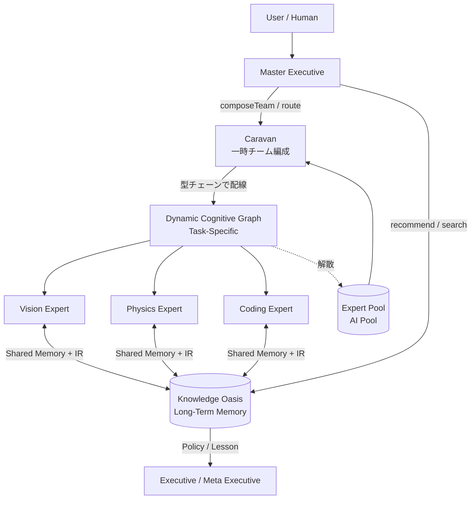
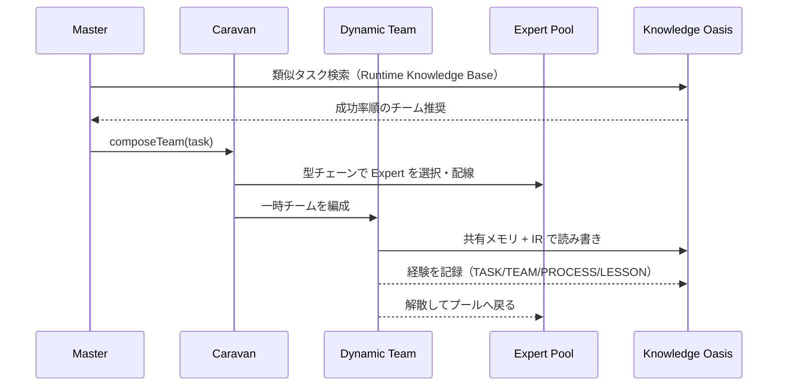

# ArcAsha Architecture

**ArcAsha — An AI Operating System for Dynamic Cognitive Runtime**

> 「知能を固定モデルではなく、ランタイムで組み立てる計算基盤」

---

## 1. 全体アーキテクチャ（1 枚図）



### 対応関係（OS と比較する）

| Linux | ArcAsha |
|-------|---------|
| **Process** | **Caravan**（タスクごとに一時編成される実行チーム） |
| **Thread** | **Dynamic Cognitive Graph**（チーム内の並行処理・配線） |
| **Memory** | **Knowledge Oasis**（長期記憶 / 共有タスクメモリ） |
| **Scheduler** | **Executive / Meta Executive**（探索・戦略・予算管理） |
| **System Call (ABI)** | **AILSM IR**（型付きデータで会話する共通言語） |
| **Kernel** | **ArcAsha Kernel / AVM**（最小・安定） |

> Transformer と比較するより **OS と比較する方が近い**。研究の独自性は
> 「AI を強くする研究」ではなく「**AI Runtime を設計する研究**」にある。

---

## 2. 論文用の 3 層 + 記憶

```
Layer 3  Knowledge Oasis（長期記憶 / Team / Policy / Lesson）
Layer 2  Caravan（動的チーム編成 / Dynamic Cognitive Graph）
Layer 1  Expert Pool + Kernel（AILSA / AILSM / AVM / Expert Runtime）
```

### 実行フロー（1 タスク）



---

## 3. 階層の責務

| 階層 | 責務 | 自律度 |
|------|------|--------|
| **Master** | どの Caravan / Oasis を使うか判断（Global Policy） | 0.9 |
| **Caravan** | タスクの Role 要件 → 動的チーム編成（Regional Policy） | 0.7 |
| **Dynamic Team** | 共有メモリ + IR で並行実行（型チェーン配線） | 0.5 |
| **Expert Pool** | 実行（Vision / Physics / Coding / Math ...） | 0.3 |
| **Knowledge Oasis** | 経験の保存・検索・推奨（Task / Reasoning / Team / Policy / Lesson） | — |

---

## 4. 研究ストーリー（砂漠とオアシス）

| 比喩 | 技術 |
|------|------|
| **Caravan**（隊商） | タスクごとに一時編成される実行チーム |
| **Journey**（旅） | Reasoning Graph（推論の旅） |
| **Oasis**（オアシス） | Knowledge Oasis Memory（長期記憶） |
| **Trade Route**（交易路） | オアシス同士を結ぶ知識検索・参照経路 |
| **Master**（司令官） | どのオアシスを経由すべきか判断 |

> ArcAsha は「経験を積み重ねる巨大なモデル」ではなく、
> 「**旅を繰り返しながらオアシスを築き、次の旅人へ知識を受け継ぐ AI OS**」。

---

## 5. 論文ロードマップ（4 本構成）

| # | 論文 | 内容 |
|---|------|------|
| 1 | **Runtime Architecture** | この図・OS 比較・階層責務 |
| 2 | **Dynamic Cognitive Graph** | 型チェーン配線・共有メモリ + IR |
| 3 | **Knowledge Oasis and Policy Learning** | 長期記憶・Lesson Memory・OS が賢くなる |
| 4 | **Distributed Caravan Runtime** | キャラバン階層・スケーラビリティ（Validation F） |

---

## 6. 関連仕様書

- `AI_COGNITIVE.md` — Composable Intelligence Runtime（動的配線 / 共有メモリ + IR / Team Learning / Knowledge Oasis）
- `AILSM_IR.md` — グラフ IR（SSA v1.8）
- `AI_REASONING.md` — Executive / Meta Executive / Expert Evolution
- `AI_ATTACHMENTS.md` — Attachment 層 / Thinking Modes
- `AI_VALIDATION.md` — Simulation vs Real Device / Validation A-F

