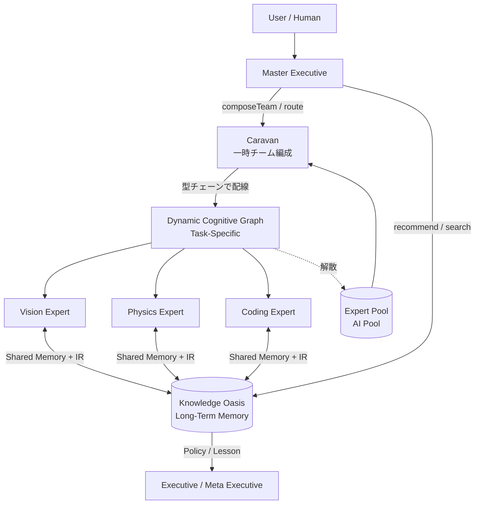
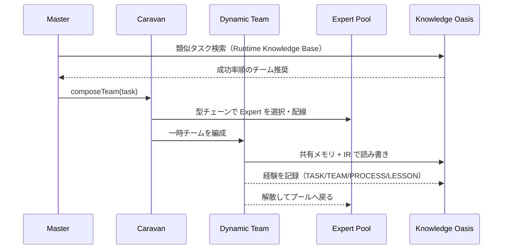

# ArcAsha 開発者マスター仕様書（総合版）

> **開発者マスター（僕）向けの「現在の ArcAsha OS のすべて」を一つにまとめた仕様書。**
>
> 新技術・既存技術・比喩・現状・検証・ロードマップを、やっていることを一つ残らず説明する。
> 資料の膨大さは気にしない。**これ一冊で ArcAsha の全体像が分かる**ことを目的とする。

| 項目 | 値 |
|------|-----|
| 文書ID | DEV_MASTER_SPEC |
| 対象読者 | 開発者マスター（プロジェクトの全容を把握する人） |
| 基準日 | 2026-08-07 |
| 最新コミット | `6e89218`（feat(bench): Validation G + ARCHITECTURE.md + ArcAsha IR 1.0 BNF） |
| 現在バージョン | **v1.2**（v1.0 リリース済み / v1.1 Decision Replay / v1.2 Hierarchy + Cognitive Graph + Caravan + Oasis） |
| 関連 | `MASTER_SPEC.md`（正式 v1.1 仕様）・`ARCHITECTURE.md`（1枚図）・各 `AI_*.md`（詳細仕様） |

---

## 目次

1. [プロジェクトの全体像（たった1つの問い）](#1-プロジェクトの全体像)
2. [世界観と比喩（砂漠のキャラバン・OS との対比）](#2-世界観と比喩)
3. [全体アーキテクチャ（3層 + 記憶）](#3-全体アーキテクチャ)
4. [既存技術（Phase 0-4 で実装済み）](#4-既存技術phase-0-4)
5. [新技術（v1.1 / v1.2 研究テーマ）](#5-新技術v11--v12)
6. [検証とベンチマーク（Validation A-G）](#6-検証とベンチマーク)
7. [世界観命名システム（NAMING）](#7-世界観命名システム)
8. [論文ロードマップ](#8-論文ロードマップ)
9. [研究上の位置付け（他方式との比較）](#9-研究上の位置付け)
10. [実験履歴（EXP シリーズ）](#10-実験履歴)
11. [リポジトリ構造・コマンド](#11-リポジトリ構造とコマンド)
12. [ロードマップと残タスク](#12-ロードマップと残タスク)
13. [付録：用語集・決定論の原則](#13-付録)

---

## 1. プロジェクトの全体像

### 1.1 中心となる問い（Core Research Question）

> **「もっと大きなモデル」を作るのではなく、OS レベルのランタイムで
> 推論を「構成・制御・計測・説明」できるか — 再現可能な形で。**

```
Do not put the intelligence inside a bigger model.
Manage reasoning, memory, planning, belief, and learning at the OS level —
so that even a small model (Qwen1.5B) can be composed, controlled, and measured reproducibly.
```

- **モデルは改造しない。** モデルの外側に OS レイヤーを置く。
- **知能 = 単一モデルではない**。知能は「階層的ランタイム（autonomous decision layers）」だと位置付ける（v2 研究テーマ）。
- **目的語は「LLM を作った」ではなく「AI の知能を OS レベルで構成・制御・計測できる実験基盤を作った」。**

### 1.2 3 つの軸（Explain / Replay / Learn）

| 軸 | 問い | 実装 |
|----|------|------|
| **Explain** | なぜ Reflection / Planning / Debate を使ったのか | Decision Explanation（`explain.ts`） |
| **Replay** | 判断プロセスをステップで見せられるか | Decision Replay（`replay.ts`） |
| **Learn** | 判断を学習データにできるか | OS Policy Learning（`decision-log.ts`） |

これらは **Transformer の事前学習とは直交する学習軸**。

### 1.3 歴史（v1 のルーツ → 現在）

```
v1（研究ルーツ）: 数千台のスマホで ~6.7T パラメータの "Expert Fabric" を構成する分散知能の夢
        ↓（実装は OS 層に集中）
v1.0（リリース）: AI OS 第一世代 — AILSA / AILSM / Kernel / AVM / Reasoning / Executive / Attachments / Validation
v1.1           : Decision Replay + 実機ベンチプラン
v1.2（現在）   : Hierarchy Runtime / Cognitive Graph Runtime / Caravan スケーラビリティ / Knowledge Oasis
        ↓（将来）
v2             : 階層的ランタイム知能（Hierarchical Runtime Intelligence）
```

---

## 2. 世界観と比喩

### 2.1 砂漠とオアシス（ArcAsha の研究ストーリー）

ArcAsha は「経験を積み重ねる巨大なモデル」ではなく、
**「旅を繰り返しながらオアシスを築き、次の旅人へ知識を受け継ぐ AI OS」**。

| 比喩 | 技術対応 |
|------|---------|
| **Caravan**（隊商） | タスクごとに一時編成される実行チーム |
| **Journey**（旅） | Reasoning Graph（推論の旅） |
| **Oasis**（オアシス） | Knowledge Oasis（長期記憶） |
| **Trade Route**（交易路） | オアシス同士を結ぶ知識検索・参照経路（Runtime Knowledge Base） |
| **Master**（司令官） | どのオアシスを経由すべきか判断する層 |

### 2.2 OS との対応（ArcAsha を説明する最強の比喩）

> Transformer と比較するより **OS と比較する方が近い**。
> 研究の独自性は「AI を強くする研究」ではなく「**AI Runtime を設計する研究**」。

| Linux | ArcAsha |
|-------|---------|
| **Process** | **Caravan**（タスクごとに一時編成される実行チーム） |
| **Thread** | **Dynamic Cognitive Graph**（チーム内の並行処理・配線） |
| **Memory** | **Knowledge Oasis**（長期記憶 / 共有タスクメモリ） |
| **Scheduler** | **Executive / Meta Executive**（探索・戦略・予算管理） |
| **System Call (ABI)** | **AILSM IR**（型付きデータで会話する共通言語） |
| **Kernel** | **ArcAsha Kernel / AVM**（最小・安定） |

### 2.3 コンピュータアーキテクチャとの対応（AI 版 RISC-V / LLVM）

| コンピュータ | ArcAsha |
|-------------|---------|
| 命令セット（ISA） | **AILSA ISA**（AI版RISC-V） |
| 高級IR（LLVM IR） | **AILSM**（意味グラフ / AI Operating IR） |
| コンパイラ | Codec（Encoder / Decoder） |
| スケジューラ | ODAR |
| 実行ユニット | Expert（CPU 相当） |
| メモリ階層 | AVM（AI Virtual Memory） |
| ベンダー仕様書 | **AILSA Registry** |
| ツールチェーン | AI版 GCC / LLVM / binutils（`AI_TOOLCHAIN.md`） |

### 2.4 他の比喩（README・論文用）

- **カーネルモジュール** = Attachment（必要な時だけロードする知能）
- **仮想メモリ / デマンドページング** = AVM（必要なコンテキストだけ供給）
- **プロセススケジューラ** = Intelligence Scheduler（Thinking Budget を配分）
- **ファイルディスクリプタ** = ContextRef（実体は Kernel が保持する参照だけ）
- **TLB** = Context TLB（2回目以降は Fault しない高速変換キャッシュ）
- **Page Fault** = Context Fault（Expert が必要ページを要求）
- **コンテキストスイッチ** = Expert 切替時の save() / restore()

---

## 3. 全体アーキテクチャ

### 3.1 3 層 + 記憶（論文用）

```
Layer 3  Knowledge Oasis（長期記憶 / Team / Policy / Lesson）
Layer 2  Caravan（動的チーム編成 / Dynamic Cognitive Graph）
Layer 1  Expert Pool + Kernel（AILSA / AILSM / AVM / Expert Runtime）
```

正式な 3 層（v1.0）:

```
Layer 3  Intelligence Attachments
         Reflection / Debate / Planning / Search / Creativity / Simulation / Coding
Layer 2  Executive Runtime
         Executive / Meta Executive / Expert Evolution / Intelligence Scheduler
Layer 1  Fast Runtime
         Kernel / AVM / Expert Runtime / ODAR / Device Tree   ← realtime, always fast
```

- **Fast vs Deliberation**: Layer 1 はリアルタイム制御（ロボット 30.3fps）を保つ。Layers 2-3 は必要な時だけロード。
- **Kernel 最小主義**: OS コアは小さく安定。高度な知能は Attachment（オプションのカーネルモジュール）。

### 3.2 全体図（mermaid）



### 3.3 実行フロー（1 タスク）



### 3.4 階層の責務と自律度（Hierarchy Runtime）

| 階層 | 責務 | 自律度 |
|------|------|--------|
| **Master** | どの Caravan / Oasis を使うか判断（Global Policy） | 0.9 |
| **Caravan** | タスクの Role 要件 → 動的チーム編成（Regional Policy） | 0.7 |
| **Dynamic Team** | 共有メモリ + IR で並行実行（型チェーン配線） | 0.5 |
| **Expert Pool** | 実行（Vision / Physics / Coding / Math ...） | 0.3 |
| **Knowledge Oasis** | 経験の保存・検索・推奨（Task / Reasoning / Team / Policy / Lesson） | — |

---

## 4. 既存技術（Phase 0-4）

> v1.0 で実装済み。全て `npm run ailsm:selftest`（[1]-[72]）+ `npm run ailsm:golden`（30）+ `npm run ailsa:selftest` + `npm run build` で検証されている。

### 4.1 AILSA — AI 版 RISC-V（命令セット）

- **位置付け**: AILSA は「AI 共通言語」ではなく **AI 専用命令セット（ISA）**。
- 基本命令は少ない: `CALL` `RETURN` `STORE` `LOAD` `FAIL` `SUCCESS` `PLAN` `VERIFY`
- その上に専門 IR（Math IR / Code IR / Reasoning IR / Search IR）が載る。
- **Registry v1.2.0**（66+ 命令）: `registry.json` が唯一の権威。ID 不変則（削除・ID 変更は MAJOR / 追加は MINOR）。
- フォーマット: `Opcode(1byte) + Slot(1byte) + Value(varint + UTF-8)`。
- Token ID 割当例: `TASK_SOLVE=0x04` `DOMAIN_MATH=0x12` `CALL=0x30` `EQ=0x41` `SYSCALL_EXECUTE=0x80`...
- 実装: `src/arcasha/ailsa/`（registry.json / vocab / opcode / dialect / schema / encoder / decoder / validator / codec / selftest）

### 4.2 AILSM — AI Operating IR（SSA グラフ中間表現）

- **位置付け**: 全サブシステムが共有する意味中間表現。**AI の内部状態全体を SSA として管理する実行可能 IR（AI State IR）**。
- 自然言語は入口と出口だけ。内部は全て AILSM。
- **Spec v1.8（凍結）**。全ノードに一意 ID（`Task#N` / `Object#N` / `Value#N`）。
- ノード種別（23 種）: Task / Object / Value / Memory / Belief / Plan / Reflection / Capability / Schedule / Process / Thread / Namespace / Context / Page / Slice / Cache / Execution / Chunk / Span / Frame / Hypothesis / Executive / MetaExecutive / Expert
- エッジ: `uses` `input` `produces` `stores` `informs` `plans` `reflects` `contains` `hypothesizes` `expands` `manages` `specializes` `mergesInto`
- **型システム（Typed AILSM）**: number / string / boolean / circle / square / triangle / equation / matrix / function / class / query / unknown + union / optional + NodeConstraints（静的検査）
- 可視化: `npm run ailsm:visualize` / `public/ailsm-viewer.html`（Mermaid / DOT / ASCII）
- 実装: `src/arcasha/ailsm/ailsm.ts`, `types.ts`, `visualizer.ts`, `state.ts`, `scheduler.ts`, `runtime.ts`, `kernel.ts`, `namespace.ts`, `executor.ts`...

### 4.3 AILSM Compiler（AI コンパイラ）

- パイプライン: `Lexer → Parser → Normalizer → Semantic Analyzer → Optimizer(-O0..-O3) → AILSA Generator`
- 100% 決定論。検証を通らないプログラムは返さない。
- **3 段階精度保証**:
  - Stage 1: Deterministic Parser（辞書・規則で閉じた語彙を変換、同義語を正準語へ）100%
  - Stage 2: LLM 残差（辞書で判定できない部分だけ LLM へ、閉じた語彙に制約）
  - Stage 3: Verifier 5 種（Syntax / Semantic / Capability / Consistency / Safety）
- Optimizer Pass: DeadNodeElimination / Dedup / ConstantFolding（`2+3→5`）/ BatchDetection
- 実装: `src/arcasha/ailsm/compiler.ts` ほか

### 4.4 AILSA Runtime / Executor（Expert = CPU）

- `executor.ts`: 組み込み演算（ADD / SUB / MUL / DIV / SQRT / SQUARE）を LLM 無しで実行。100% 決定論。
  - `resolved=true` → ローカル解決 / `needsExpert=true` → CALL/RETURN で Expert 委譲
- **AI State SSA**（Phase 0.9）: Memory / Belief / Plan / Reflection も SSA ノード化。
- **AI Process / Thread / Scheduler**（Phase 0.11）: ライフサイクル `created → ready → running → {waiting/finished/failed}`。Runtime Events（SPAWN/CALL/RETURN/YIELD/WAIT/RESUME/PREEMPT/TIMEOUT/FAIL/FINISH）。`pickNext`（最高優先度・同点 ID 昇順）/ `pickRoundRobin`。
- **AI System Call / Kernel API**（Phase 0.12）: Expert（User Space）は Kernel に直接触れない。`SYSCALL_*`（AILSA 0x80-0x8A）経由。権限チェック付き（別 owner の DELETE 拒否）。
- **Namespace / Virtual Memory**（Phase 0.13）: プロセスごとに Memory Space 分離。`canAccessMemory` / `pageMemory`。
- **AI Runtime Model v1.0（凍結）**。

### 4.5 AI Virtual Memory（AVM）— コンテキストを仮想メモリ化

- **動機**: 「コンテキストウィンドウを 200K/1M に拡大」ではなく、巨大な知識空間を仮想メモリとして管理。
- **5 層**: Context Virtual Memory → Context Paging → Slice Loader → Context ABI → Context Cache
- SSA ノード: `Context#N` / `Page#N` / `Slice#N` / `Cache#N` + `Execution#N` / `Chunk#N` / `Span#N` / `Frame#N`
- **Long Context ABI**: `ContextRef { contextId, pageIds, sliceId? }`（= file descriptor）。実体は Kernel が保持。
- **Execution Context**: 思考途中（current page / hypothesis / vars / call stack / resident pages）を保存。save() / restore() でコンテキストスイッチ。
- **Demand Paging / Context Fault / Prefetcher**: Expert が必要ページを要求 → 未ロードなら Fault → Kernel がロード。
- **Memory Hierarchy**: Document → Page → Chunk（段落）→ Span（文/数式）。Context TLB。Hot / Warm / Cold Tier。
- **検証**: 4.10× speedup / −77% tokens（kind=simulation）。3.5x が 100〜5000 ページまで安定（Phase 2.0 実験）。
- 実装: `src/arcasha/ailsm/context.ts`, `slice.ts`, `cache.ts`, `avm.ts`, `execution.ts`, `demand-paging.ts`, `chunk.ts`, `context-tlb.ts`, `tier.ts`, `abi.ts`

### 4.6 AI ABI / Driver / DeviceTree（Expert 間の受け渡し規約）

- **Argument ABI**: `{ type, shape, ownership, alignment }`
- **Return ABI / Error ABI**（エラーコード・recoverable / retryable）
- **Version Negotiation**: Kernel が `supportsAbi(kernel, expert)` で確認してから CALL。
- **Capability ABI**: `capabilityFulfills(required, capability)` で交換可否判定。
- **Expert Driver**: `ExpertDriver` インターフェース。`MockExpertDriver`（決定論スタブ）→ `RemoteDriver`（実 LLM）へ差し替え可能。
- **Device Tree**: Linux の Device Tree 相当。`registerNode / node / list / describe`（gpu / ramMB / battery / network / language / cost / features）。
- 実装: `src/arcasha/ailsm/abi.ts`, `driver.ts`, `device-tree.ts`, `expert-runtime.ts`

### 4.7 ODAR（適応ルーティング）と学習

- **ODAR = SSA**: 委譲チェーン `Belief → Capability → Schedule → CALL`。
- **CapabilityLearner**（Phase 2.2 / Phase 1.4）: 実実行の観測（accuracy / latencyMs / cost / success / battery / gpu）を **EMA** で逐次更新。`score()` は「精度 × 成功率 × 残量 × GPU空き」/「レイテンシ + コスト」。
- `updateCapabilitySsa()`: AILSM の Capability ノードを in-place 更新（ODAR = SSA が学習する）。
- 実装: `src/arcasha/ailsm/learning.ts`, `capability.ts`

### 4.8 AI Reasoning Runtime（Hypothesis SSA / Reasoning Graph）— 第4の柱

- **動機**: 創発的知能は OS だけでは生まれない。GPT/MoE は Transformer 内部で暗黙に探索する。ArcAsha は **OS（プロセス / SSA）で明示的に管理**する。
- **Hypothesis SSA**: `Hypothesis#N`（state: proposed → active → accepted / rejected / merged / killed）。操作: SPAWN / EVALUATE / ACCEPT / KILL / MERGE。
- **Reasoning Graph Runtime**: 仮説ビーム探索を OS が管理。各仮説 = 独立 AI Process（並列）。
- **Reasoning Search Runtime**（Phase 2.5）: 探索ポリシーをプラグイン化（BeamSearch / BestFirst / DFS / BFS / MCTS-UCB1）。探索 vs 活用: `selectionScore = score×(1−explore) + novelty×explore − cost×costPenalty`。
- **Executive Runtime**（Phase 2.6）: ループ `READY → EXPAND → EVALUATE → REFLECT → EXECUTIVE（戦略切替）→ 次ラウンド`。停滞検知 → 探索へ切替（beam+2 / explore+0.4 / Expert 追加）、成功+淘汰 → 活用へ。
- **Meta Executive**（Phase 2.7）: `estimateBudget`（Thinking Budget: trivial / high / battery 等で「そもそも今考えるべきか」を決定）。学習ループ: `metaScore = accuracy − latency/10000 − cost×0.02`。設定 → 結果を蓄積し最良を推奨。Search Policy 自体も切替。
- **Expert Evolution**（Phase 2.9）: Expert が SPLIT / MERGE / RETIRE を客観的基準（Expert Health / Utilization / Overlap）で自律進化。MoE との最大の違い: Gate の先の Expert は固定だが、ArcAsha は Expert 自体が分裂・統合・引退する **AI の生態系**。
- 実装: `src/arcasha/ailsm/reasoning.ts`, `reasoning-runtime.ts`, `search.ts`, `reasoning-search.ts`, `executive.ts`, `executive-runtime.ts`, `meta-executive.ts`, `meta-executive-runtime.ts`, `expert-evolution.ts`, `expert-evolution-runtime.ts`

### 4.9 Intelligence Attachments（プラグイン層）

- **思想**: Kernel は最小限・知能は Attachment（= Linux のオプションのカーネルモジュール）。
- **インターフェース**: `Attachment { id, name, version, enabled, supports(taskText), run(ctx) }` + `AttachmentMeta`（estimatedCost / estimatedLatency / estimatedAccuracy）。
- **Attachment Manager**: register / unregister / load（遅延ロード）/ unload / enable / disable / execute / executeParallel / executeMerged。
- **組み込み 7 種**:
  | Attachment | パイプライン | 再利用する既存 Runtime |
  |-----------|--------------|----------------------|
  | Reflection | Answer→Reflection→Score→Revision→Return | 自己批判の決定論パイプライン |
  | Debate | Expert A/B/C→Judge→Consensus | Reasoning Search（立場=Hypothesis, Judge=ACCEPT） |
  | Planning | Goal→Sub Goals→Execution Plan→Scheduling | AILSM Plan SSA |
  | Search | BFS/DFS/Beam/Best-First/MCTS | Search Runtime |
  | Creativity | 複数の新しい仮説を生成 | Hypothesis SSA |
  | Simulation | What-if→分岐実行→統合 | Hypothesis SSA（merge） |
  | Coding | 解析→アーキテクチャ理解→パッチ→自己レビュー→コンパイル→リトライ | Executive Runtime |
- **制約**: Attachment は Kernel 状態を直接変更しない。全通信は Executive 経由。AVM のみ使用、Context は ContextRef でしか交換しない。
- 実装: `src/arcasha/attachments/`

### 4.10 Thinking Modes（Fast / Auto / Deep / Custom）

- **他 AI の「Thinking ON/OFF」はブラックボックス**。ArcAsha は同じ OS の上で実行パイプラインだけを変え、どの Attachment がどれだけ時間を使ったかを可視化。
- モード:
  - **Fast**: Kernel → Expert Runtime → Answer（Attachment なし）— ロボット・リアルタイム
  - **Auto**: Executive がタスクから自動選択（2+2 → Fast / 批判的レビュー → Reflection+Debate）
  - **Deep**: Planning → Debate → Reflection → Simulation（研究・長時間推論）
  - **Custom**: ユーザーが手動選択
- **Intelligence Scheduler**: `intelligenceScheduler(attachments, budgetMs)` が **Thinking Budget** 内で優先度順に配分。可視化例: `reflection 150ms / debate 400ms / TOTAL 550ms`。
- 実装: `src/arcasha/attachments/modes.ts`, `scheduler.ts`

### 4.11 Explainable（説明・再生・学習）

- **Decision Explanation**（`explain.ts`）: なぜこのモード / Attachment 構成か。期待ゲイン（Planning +31% / Debate +22% / Creativity +28% / Reflection +19%、合計 ≈ +34%）。
- **Decision Replay**（`replay.ts`）: `npx arcasha replay`。Round1-4 を理由・ゲイン・出力つきでステップ再生。
- **OS Policy Learning**（`decision-log.ts`）: Decision Log を EMA（α=0.3）で学習し、Meta Executive のポリシー（期待ゲイン）を更新。`npx arcasha policy`。

### 4.12 Observability（計測器 = perf / top / htop 相当）

- **aiperf**（`perf.ts`）: Context Fault Rate / TLB Hit Rate / Memory Tier / CALL 統計 / Expert 利用率。
- **AI Trace**（`trace.ts`）: Chrome Trace 互換（Perfetto / chrome://tracing で可視化）。
- **AI Profiler**（`profiler.ts`）: Hot Expert / Hot Context / Hot Pages / Fault Hotspot。
- **AI Benchmark**（`benchmark.ts`）: Long Context 比較（Token 削減 77.1% / Speedup 3.53x）。
- 実装: `src/arcasha/ailsm/perf.ts`, `trace.ts`, `profiler.ts`, `benchmark.ts`, `observability.ts`

### 4.13 AI Toolchain（AI 版 GCC / LLVM / binutils）

- **AI Program**（`program.ts`）: AILSM で直接プログラムを書ける DSL（`.plan().call('math').math(EQ).verify().reflect().returns()`）。
- **AILSM Optimizer**（`optimizer.ts`）: DCE / CALL バッチ化（`CALL Math ×3 → CALL Math Batch=3`）。
- **AI Assembler**: AILSA 命令列 → バイト列（Codec）。
- **AI Linker**（`linker.ts`）: 複数 Expert の IR（Object File 相当）を結合して Executable Task を生成。CALL/RETURN でラップ + シンボルテーブル + 再検証。
- 実装: `src/arcasha/ailsm/program.ts`, `optimizer.ts`, `linker.ts`

### 4.14 Phase 1 実機実行系（実 LLM / Hub / 分散）

- **Phase 1.0 実 LLM Driver**: `model-client.ts` + `remote-driver.ts`。ExpertHub（WS:8080）→ iPad/iPhone の llama.cpp/ggml-metal。
- **Phase 1.1 Multi-expert AILSA Relay**（`relay.ts`）: Planner → Math → Search → Reasoning → Planner の 5 ホップ。
- **Phase 1.2 Hub = AI OS**: `demo-web.ts`（WS:8080 + Web:4173）+ `aios.ts`（initAiOs）。`/api/ailsm` / `/api/relay` / `/api/device-tree`。
- **Phase 1.3 Device Tree 実働**: 接続ノードを自動登録。`routeCall`（優先指定 → Mac/ローカル → 最初のノード）。
- **Phase 1.4 分散 Context**: ページをデバイスへ配置（`assignPageDevice` / `distributedFault`）。
- **Phase 2.3 フォールバック**: 「作って」系意図（create）+ Stage-2 フォールバック（AilsmError → CALL general → 実機 LLM へ委譲）。「既存 AI ができるタスクを全部任せられる」。

### 4.15 その他の実装（v1.0 以前のモジュール）

| モジュール | 内容 |
|-----------|------|
| `src/arcasha/belief/bayesian.ts` | Bayesian Belief（μ, n, confidence）— Belief-Driven の核 |
| `src/arcasha/router/linucb.ts` | LinUCB-Shadow（フル情報フィードバックのルーティング学習） |
| `src/arcasha/router/router.ts` | ルーター |
| `src/arcasha/planner/decomposer.ts` / `llm_planner.ts` | タスク分解 |
| `src/arcasha/reflect/reflector.ts` | 反射（原因診断 → 対処） |
| `src/arcasha/search/tree.ts` | 木探索（Beam） |
| `src/arcasha/shadow/shadow.ts` | シャドウ実行（Failover） |
| `src/arcasha/verifier/verifier.ts` | 検証 |
| `src/arcasha/experts/registry.ts` | ExpertHub（Caravan 分割、nodeMetrics、peer 通信、caravanRoute） |
| `src/arcasha/binary/` | バイナリ配線 |
| `src/arcasha/nodes/ios-metal/ippitsu/` | iPad/iPhone の llama.cpp 同梱アプリ |

---

## 5. 新技術（v1.1 / v1.2）

### 5.1 Decision Replay（v1.1）

- **「なぜこの回答になったのか」を動画のように再生**。
- `renderReplayStep(trace, i)` で 1 コマずつ再生（GUI アニメーションの土台）。
- `npx arcasha replay` / `arcasha replay タスク文`。
- 例: Round1 reflection (+19%/150ms) → Round2 creativity (+28%/200ms) → Round3 debate (+22%/400ms) → Round4 planning (+31%/250ms) → Final quality=0.88。
- 実装: `src/arcasha/attachments/replay.ts`。selftest [72]。

### 5.2 Hierarchy Runtime（v1.2 / 研究テーマ v2 の一角）

> **Intelligence is not a monolithic model, but a hierarchical runtime composed of autonomous decision layers.**
> （知能は単一モデルではなく、自律的な意思決定層から構成される階層的ランタイムである。）

- 階層: **Master → Caravan（Role 付き）→ Device → Expert**（最終形は Human → Executive → Cluster → Computer → LLM → Reasoning の 6 階層）。
- 各階層が **Decision / Policy / Budget / Memory** を持ち「**考える → 判断する → 命令する → 学習する**」を自律的に行う。
- **自律度**: Master 0.9 / Caravan 0.7 / Device 0.5 / Expert 0.3。
- **予算**: Master {5000ms, 300mW, 1024MB} / Caravan {2000ms, 500mW, 512MB} / Device {800ms, 1500mW, 256MB} / Expert {300ms, 2000mW, 64MB}。
- **階層間は「情報要約」でやり取り**（`summarize` / `climbSummary` — 下位の詳細をそのまま上位へ送らない）。
- **各階層が独立に学習**: `learnNode`（outcome を EMA α=0.3 でポリシーに反映、Memory に記録 → 要約更新）。
- Caravan は Role 付き（Vision / Language / Math / Planning / Search / Robot）— 脳の領域のような役割分担。
- 実行: `npx arcasha hierarchy`。実装: `src/arcasha/hierarchy/hierarchy.ts`, `hierarchy-runtime.ts`。selftest [73]。

### 5.3 Cognitive Graph Runtime（Composable Intelligence Runtime）（v1.2）

> **「モデルを選ぶ」のではなく、「タスクごとに知能の配線を生成する」。**

- Transformer は推論時の計算グラフが固定。MoE は一部の Expert を選ぶが構造は変わらない。ArcAsha は:
  1. AI Pool から Expert を選ぶ
  2. Expert 同士をその場で接続する（**凸凹 = データ型**）
  3. 共通メモリを共有する（Shared Task Memory）
  4. IR（AILSM）で通信する（自然言語不要）
  5. タスク終了後に解散する

#### 5.3.1 AI Pool（`pool.ts`）

- 8 種の未所属 Expert（planning / vision / physics / coding / robot / math / search / memory）。
- 各 Expert は `inputType → outputType`（凸凹 = データ型）。例: `Vision input:camera output:object-list` / `Physics input:object-list output:trajectory` / `Coding input:trajectory output:program`。

#### 5.3.2 Capability Graph（`capability-graph.ts`）

- `canConnect(from, to)`: `from.outputType === to.inputType` で接続可否。
- `detectRoles(task)`: ROLE_RE + DOMAIN_COMPLEMENT でタスクの Role 要件を検出。
- `composeTeam(pool, task)`: 型チェーンで実行順を自動決定。`camera → Vision → object-list → Physics → trajectory → Coding → program`。
- `renderComposition` で編成を表示。

#### 5.3.3 共有タスクメモリ + IR 通信（`runtime.ts`）

```
[vision]   write object-list: [door(conf 0.93), obstacle(conf 0.63)]
[physics]  read  object-list → write trajectory: [waypoints=2, risk=0.22]
[coding]   read  trajectory  → write program: [plan=motor-control-v4, lines=19]
```

- `runCognitive(team, task)`: 共有メモリ + IR 値（`genIr` は決定論・float 丸め）で実行。
- 自然言語は不要。型付きデータ（IR）がメモリを流れる。

#### 5.3.4 Team Learning（`team-learning.ts`）

- `TeamLearner.record(teamKey, success, quality)` で蓄積 → `recommend(candidates)` が成功率の高いチームを推奨。
- 1000 回仕事をすると、成功率の高いチーム編成を自然に優先。
- **モデルの重みではなく OS レベルの運用知識**（再学習不要）。

#### 5.3.5 Knowledge Oasis（`oasis.ts`）— 長期記憶

- タスク完了ごとに経験を IR で保存: `TASK / TEAM / GRAPH / RESULT / LESSON`。
- **アーカイブ構成**:
  ```
  Long Memory
  ├── Task Archive      （何をやったか = 履歴）
  ├── Reasoning Archive （どう考えたか = 仮説・配線）
  ├── Team Archive      （誰がやったか）
  ├── Policy Archive    （何を学習したか = Meta Executive がチーム編成を学ぶ）
  ├── Lesson Archive    （今回何を学んだか = 知識抽出）
  └── Runtime Knowledge Base（類似タスク検索・成功率順のチーム推奨）
  ```
- **権限（Need-to-know）**: Master = 全部 / Caravan = Task+Reasoning+Policy / Expert = Task+Reasoning / Attachment = 必要部分だけ。`view(role, e)`。
- `search(query)` / `recommend(query)` / `lessons()` / `makeLesson()`。

#### 5.3.6 デモ（`demo.ts`）

- 6 タスク（自律飛行ドローン設計 / 物体検出 / 移動計画 / 飛行軌道 / 二次方程式 / 衝突回避）でチーム編成 → 実行 → Team Learning → Oasis 記録 → 推奨。
- 実行: `npx arcasha cognitive`。selftest [75]。

### 5.4 ArcAsha IR 1.0（BNF 仕様）— 経験記録の共通言語

Cognitive Graph Runtime の経験・通信を記録する公式仕様（`AI_COGNITIVE.md` §8）。

```
<oasis-record> ::= <task> <team> <process> <memory> <lesson>
                 | <task> <team> <process> <memory>
<task>    ::= "TASK" <ws> <string>
<team>    ::= "TEAM" <ws> <role> { "," <role> }
<role>    ::= "planning" | "vision" | "physics" | "coding" | "robot"
            | "math" | "search" | "memory"
<process> ::= "PROCESS" <ws> <edge> { ";" <edge> }
<edge>    ::= <expert-id> "->" <expert-id> "(" <data-type> ")"
<data-type> ::= "goal" | "plan" | "camera" | "object-list" | "trajectory"
              | "motion" | "program" | "equation" | "solution" | "query"
              | "documents" | "context" | "knowledge"
<memory>  ::= "MEMORY" <ws> <entry> { ";" <entry> }
<entry>   ::= <data-type> ":" <ir-value>
<lesson>  ::= "LESSON" <ws> <string> "confidence" <number>
```

記録例:

```
TASK: robot_navigation
TEAM: planning, vision, physics, coding
PROCESS: vision->physics(object-list); physics->coding(trajectory); planning->memory(plan)
MEMORY: object-list:[door(conf 0.93), obstacle(conf 0.63)]; trajectory:[waypoints 2, risk 0.22]; program:[plan motor-control-v4]
LESSON: Physics before Coding confidence 0.94
```

意味（データフロー）: `TASK → 何をやったか / TEAM → 誰がやったか / PROCESS → どう配線したか / MEMORY → 何を受け渡したか / LESSON → 何を学んだか（→ Policy）`。

### 5.5 Validation F — Caravan スケーラビリティ（v1.2）

**「キャラバン分割がスケールする」ことを定量実証**（`bench/caravan.ts`）。

| デバイス数 | キャラバン数 | Master管理対象(Flat) | Master管理対象(Caravan) | 削減 | 探索(Flat) | 探索(Caravan) | ホップ |
|---:|---:|---:|---:|---:|---:|---:|---:|
| 10 | 1 | 10 | 2 | **5x** | 10 | 11 | 1→2 |
| 100 | 10 | 100 | 11 | **9.09x** | 100 | 20 | 1→2 |
| 1,000 | 100 | 1,000 | 101 | **9.9x** | 1,000 | 110 | 1→2 |
| 10,000 | 1,000 | 10,000 | 1,001 | **9.99x** | 10,000 | 1,010 | 1→2 |

- **10,000 台でも Master は 1,000 キャラバンを管理するだけ**（9.99x 削減）。
- ルーティングは Master → Caravan → Device の 2 ホップ。
- kind=simulation（決定論）。`npm run benchmark` に統合（report.json の `caravanScaling`）。selftest [74]。

### 5.6 Validation G — Lesson Memory / Team Learning の効果（v1.2）

**「モデルを再学習しなくても OS が賢くなる」ことを定量実証**（`bench/oasis.ts`）。

- 1000 タスクのシミュレーション。チーム候補の真の成功率は固定（決定論・kind=simulation）。
- Naive（経験なし・ランダムチーム）vs Learned（TeamLearner が成功率を学習 + ε-greedy 探索→活用 + 経験キャッシュで高速化）。

| フェーズ | タスク数 | 成功率(Naive) | 成功率(Learned) | 平均遅延(Naive) | 平均遅延(Learned) | 平均品質(Learned) |
|---|---:|---:|---:|---:|---:|---:|
| warmup | 100 | 67% | 75% | 711ms | 606ms | 76% |
| early | 300 | 68% | 89% | 713ms | 629ms | 87% |
| mid | 600 | 68% | 92% | 715ms | 634ms | 90% |
| late | 1000 | 67% | 93% | 714ms | 637ms | 91% |

- **成功率 67% → 93%（+26pt）** / 平均遅延 714→637ms（-77ms）/ 品質 +28pt。
- **学習が進むほど改善**（warmup 75% → late 93%）— 探索→活用で最適チームに収束。
- 蓄積されるのは **LLM の重みではなく OS の運用知識**（Team / Policy / Lesson）。
- `npm run benchmark` に統合（report.json の `oasisLearning`）。selftest [76]。

> **技術メモ（決定論乱数の教訓）**: 旧 `hash()` は下位ビットが偏り、Naive が常に 0.95 チームに集中して 95% に歪んでいた。**splitmix32 の一様 rng(seed)**（Naive/Learned で独立 seed）に置換して解決。チーム選択・成功判定は必ず一様 rng を分離して使う。

### 5.7 Web コンソール / AI OS Monitor（v1.2 多機能化）

- **`demo-web.ts`**: ExpertHub（WS:8080）+ Web（:4173）。
  - `/api/nodes` / `/api/info` / `/api/prompt` / `/api/monitor`（tree + peerLog + nodes + roles 追加）/ `/api/node/:id/disconnect` / `/api/peer` / `/api/ailsm` / `/api/device-tree` / `/api/relay`
  - ノード選択は**ラウンドロビン**（`nextNodeId()` — 役職の偏りを可視化）。
- **`public/aios-monitor.html`**: 
  - **DeviceTree 樹形図**（Master → キャラバン → デバイス）
  - Power & Network カード
  - Role Distribution（役職の偏り）
  - Neuron Network（デバイス間ピア会話）
  - デバイス disconnect ボタン
- **`public/worker-inference.js` / `akasha-client-web/`**: WebGPU 推論（Web ブラウザでの推論実行）。

---

## 6. 検証とベンチマーク

### 6.1 2 本立て（重要）

| 種別 | 内容 | ラベル |
|------|------|--------|
| **Simulation** | 決定論シミュレータ（設計上の評価モデル） | `kind: 'simulation'` |
| **Real Device** | iPhone / iPad / Mac 実機 + Qwen1.5B 実測 | `kind: 'real-device'` |

- Simulation は「設計上の評価モデル」として価値（再現可能・決定論）。
- Real Device は未接続時 `not-connected` を返し、**数値を偽造しない**。

### 6.2 Validation 一覧

| ID | 内容 | 主な数字 |
|----|------|---------|
| A | Long Context（Qwen vs ArcAsha AVM） | 4.10× / −77.1% tokens |
| B | Reasoning（Normal/Reflection/Planning/Debate/All） | fast 57% → all 93%（単調増加） |
| C | Robot（Fast/Auto/Deep） | Fast 30.3fps ✓ / Deep 1.2fps ✗ |
| D | Executive（なし/あり/Meta） | quality 0.50 → 0.71 / Meta は少ない推論で同品質 |
| E | External Benchmarks（GSM8K/MATH500/HumanEval/MBPP/MMLU/LiveCodeBench） | Qwen1.5B 27% → +Deep 95% |
| F | Caravan スケーラビリティ | 10,000 台で 9.99x 管理削減 / 2 ホップ |
| G | Lesson Memory / Team Learning | 成功率 67% → 93%（+26pt）/ 遅延 −77ms |

### 6.3 External Benchmarks（Validation E）

```
suite           Qwen1.5B 単体  Qwen1.5B Thinking  + ArcAsha Fast  + ArcAsha Auto  + ArcAsha Deep
gsm8k             70%  100%  100%  100%  100%
math500            0%   30%   20%   60%   90%
human_eval        10%   50%   40%   80%  100%
mbpp              50%   90%   80%  100%  100%
mmlu              30%   70%   60%  100%  100%
livecodebench      0%   20%   10%   50%   80%
ALL               27%   60%   52%   82%   95%
```

- **全体正答率 27% → 95%**（Qwen 単体 → +Deep、3.5 倍）。
- **Qwen Thinking vs ArcAsha**: human_eval で Qwen Thinking 50% > +Fast 40% だが **+Deep 100% > Qwen Thinking 50%**。

### 6.4 Flagship — 同じ Qwen1.5B、OS 構成違い

```
config            latency   quality  power   note
Qwen1.5B 単体       1500ms   0.57   1800mW  モデル単体
+ ArcAsha Fast    1200ms   0.63   1100mW  AVM + ODAR ルーティング
+ ArcAsha Auto    1750ms   0.74   1750mW  Reflection+Debate 自動起動
+ ArcAsha Deep    2400ms   0.79   2400mW  全 Attachment 積極利用
```

**同じ Qwen1.5B でも OS 構成で 品質 0.57→0.79（+38%）**。

### 6.5 OS Overhead

```
+ ArcAsha Fast:  Kernel 2% | Scheduler 3% | AVM 5% | Routing 5% | LLM 85%
+ ArcAsha Auto:  Kernel 2% | Scheduler 4% | AVM 6% | Executive 8% | Attachments 15% | LLM 65%
+ ArcAsha Deep:  Kernel 2% | Scheduler 5% | AVM 8% | Executive 10% | Attachments 35% | LLM 40%
```

**OS を増やしても LLM 以外のオーバーヘッドは小さい**。

### 6.6 レポート自動生成

`npm run benchmark` 一発で全項目 + `reports/benchmark/report.{json,csv,md}` を自動生成（機械可読・追試可能・バージョン付き・kind=simulation 明示）。`REPORT_VERSION` は現在 **1.3.0**。

---

## 7. 世界観命名システム

### 7.1 v1.0+ Reasoning Set

```
ArcAsha (AI OS)
├── Core                (Kernel / AVM)
├── Thought Graph       (AILSM IR)
├── Command Deck        (Executive Runtime)
│   ├── Conductor       (Executive)
│   ├── Strategist      (Meta Executive)
│   └── Metamorphosis   (Expert Evolution)
├── Tempo               (Thinking Modes)
├── Facet               (Attachment)
│   ├── Mirror          (Reflection)
│   ├── Symposium       (Debate)
│   ├── Blueprint       (Planning)
│   ├── Expedition      (Search)
│   ├── Genesis         (Creativity)
│   ├── Simulacrum      (Simulation)
│   └── Anvil           (Coding)
├── Verdict             (Decision Explanation)
├── Retrospect          (Decision Replay)
└── Mentorship          (OS Policy Learning)
```

### 7.2 命名ルール

- 世界観名には初出時に必ず正式名称を併記（例: **Conductor (Executive)**）。
- コードでは英語 identifier、JSDoc に世界観名を付与。
- 旧 v1 の世界観名（Heart of Wisdom / Eye of Wisdom / Shadow of Wisdom 等）はレガシー（lore）として `NAMING.md` に残す。

---

## 8. 論文ロードマップ

### 8.1 主論文

- **PAPER_OUTLINE.md**: 「ArcAsha: An Explainable Runtime for AI Intelligence」
- Contributions: Explainable Reasoning / Explainable Scheduling / Explainable Policy Learning。

### 8.2 4 本構成（ARCHITECTURE.md）

| # | 論文 | 内容 |
|---|------|------|
| 1 | **Runtime Architecture** | 全体図・OS 比較・階層責務 |
| 2 | **Dynamic Cognitive Graph** | 型チェーン配線・共有メモリ + IR |
| 3 | **Knowledge Oasis and Policy Learning** | 長期記憶・Lesson Memory・OS が賢くなる |
| 4 | **Distributed Caravan Runtime** | キャラバン階層・スケーラビリティ（Validation F） |

### 8.3 独立論文化可能な仕様（ArcAsha から独立して利用可能）

- AILSM: "AILSM: A Stateful SSA Intermediate Representation for AI Systems" / "AI State IR" / "AI Operating IR"
- AILSA / AILSA ISA / AILSA Runtime / AILSM Compiler / AI Toolchain / AI ABI / AI Virtual Memory / AI Reasoning Runtime / AI Attachments / AI Observability
- 既存の比較表（`src/arcasha/docs/COMPARISON.md`）: LangGraph / DSPy / AutoGen / CrewAI / OpenAI Agents SDK との比較。**「構造を宣言する」ではなく「信念から構造を生成する（Emergent Policy）」**が独自点。

### 8.4 理論ドキュメント（FRAMEWORK.md）

- **Belief-Driven AI Orchestration**: 全モジュールを「Belief（状態推定）」を中核にした一つの実行系として統合。
- Closed Bayesian Loop: $\mu_0 \xrightarrow{\text{Observation (Shadow)}} \mu \xrightarrow{\text{Memory (Episode)}} \mu_0'$
- 対応: Routing（capability μ を LinUCB 特徴量に）/ Planning（有効能力で Beam 枝刈り）/ Memory（類似エピソードで事前信念初期化）/ Reflection（失敗サブタスクの (μ, n) から原因診断）。
- 論文: Zenodo 10.5281/zenodo.21755612 で凍結した実験系列を数式レベルで統一。

---

## 9. 研究上の位置付け

### 9.1 既存技術との違い（1行で）

| 技術 | 1行の違い |
|------|----------|
| **Transformer** | 推論時の計算グラフが固定 |
| **MoE** | 一部の Expert を選ぶがネットワーク構造は固定 / Gate の先の Expert は固定 |
| **マルチエージェント** | エージェント間の通信が自然言語（または固定フレームワーク） |
| **LangGraph** | 構造を宣言する。ArcAsha は信念から構造を生成する（Emergent Policy） |
| **DSPy** | プロンプトレベルの最適化。ArcAsha はエキスパート選択と実行ポリシーの最適化 |
| **RAG / KV Cache** | 全コンテキスト or 上位チャンク。ArcAsha は必要ページだけ（Fault 駆動） |
| **ArcAsha** | **型付き IR で動的配線・共有メモリ・タスク完了で解散・経験をオアシスに蓄積** |

### 9.2 研究の本質

```
ArcAsha は「経験を積み重ねる巨大なモデル」ではなく、
「旅を繰り返しながらオアシスを築き、次の旅人へ知識を受け継ぐ AI OS」。
```

蓄積されるのは **LLM の重み（パラメータ）ではない**:
- どんなチーム編成が成功したか（Team / Policy Archive）
- どんな推論経路が成功したか（Reasoning Archive）
- どんな Executive の判断が良かったか（Policy Archive）
- どんな Lesson が得られたか（Lesson Archive）

→ **モデルの知識と OS の運用知識を分離して成長させる**アーキテクチャ。

---

## 10. 実験履歴

### 10.1 EXP シリーズ（`experiments/qwen3_0.6b/`）

- EXP-0001〜0003F までの一連の実験。
- **3行結論**: ① Cross-runtime inference は機能的、トークン再現性は backend 依存。② 発散は主に数値的不定性（logit_margin < 0.02）で引き起こされ backend/kernel 差で増幅。③ 完全複製・近似冗長・独立検証は別の実行モードとして扱うべき。
- **設計原則**: **Numerical Stability は実行構成の性質**（`f(platform, backend, kernel, precision, device, model)`）。
- `APPLE_BACKEND_DESIGN.md` / `NUMERICAL_STABILITY_PROFILE.md` / `CONCLUSIONS.md` / `compare_tokenizer.ts` / `run_single_node.ts` / `golden/` / `results/` 等。

### 10.2 実験の分離

- `EXP-0001` 系 = 実行の再現性（backend 差）
- `EXP-0002` 系 = ルーティング・学習（LinUCB / Belief）
- `EXP-0003` 系 = 検証・スケーリング
- 詳細は各フォルダの README。

---

## 11. リポジトリ構造とコマンド

### 11.1 リポジトリ構成

```
Akasha-OS/                    # 単一リポジトリ（monorepo）
├── package.json              # ルート: 委譲スクリプト（setup/build/selftest/benchmark/arcasha）
├── MASTER_SPEC.md            # 正式 v1.1 仕様
├── ARCHITECTURE.md           # 1枚図・OS比較・研究ロードマップ
├── ARCASHA_V2_SPEC.md        # v2 設計仕様（v0.36）
├── AILSA_ISA.md / AILSM_IR.md / AILSM_COMPILER.md / AILSA_RUNTIME.md
├── AI_ABI.md / AI_VIRTUAL_MEMORY.md / AI_OBSERVABILITY.md / AI_RUNTIME_PHASE1.md
├── AI_REASONING.md / AI_ATTACHMENTS.md / AI_VALIDATION.md / AI_EVALUATION.md
├── AI_COGNITIVE.md           # Composable Intelligence Runtime + ArcAsha IR 1.0 BNF
├── AI_TOOLCHAIN.md / AI_EVALUATION.md / NAMING.md / PAPER_OUTLINE.md / PROTOCOL.md
├── CHANGELOG.md / CONTRIBUTING.md / LICENSE / README*.md（多言語）
├── akasha-master/            # コア実装（TypeScript）
│   ├── src/arcasha/
│   │   ├── ailsa/    # ISA（registry/vocab/opcode/dialect/schema/codec/selftest）
│   │   ├── ailsm/    # IR / Compiler / Kernel / AVM / Reasoning / Executive / ...（約60ファイル）
│   │   ├── attachments/  # Attachment 7種 / Modes / Explain / Replay / DecisionLog
│   │   ├── hierarchy/    # Hierarchy Runtime（hierarchy.ts / hierarchy-runtime.ts）
│   │   ├── cognitive/    # Cognitive Graph Runtime（pool / capability-graph / runtime / team-learning / oasis / demo）
│   │   ├── bench/        # benchmark（run / gsm8k / math500 / human_eval / mbpp / mmlu / livecodebench / overhead / real-device / caravan / oasis / report / cli）
│   │   ├── experts/      # ExpertHub（registry.ts — Caravan 分割・peer 通信）
│   │   ├── belief/ router/ planner/ reflect/ search/ shadow/ verifier/  # Belief-Driven 基盤
│   │   ├── nodes/ios-metal/ippitsu/  # iPad/iPhone llama.cpp 同梱アプリ
│   │   ├── cli.ts        # arcasha コマンド（benchmark/policy/replay/hierarchy/cognitive/version/help）
│   │   ├── demo-web.ts   # Web コンソール（WS:8080 + Web:4173）
│   │   ├── demo-hub.ts / demo-mock-node.ts
│   │   └── docs/         # FRAMEWORK.md（Belief 理論）/ COMPARISON.md（他方式比較）
│   ├── public/            # aios-monitor.html / ailsm-viewer.html / worker-inference.js / client.html / dashboard.html / node.html
│   ├── experiments/       # qwen3_0.6b（EXP シリーズ / golden / results / configs / prompts / reference）
│   ├── training/          # finetune.py / quantize.py / requirements.txt
│   ├── poc/  examples/  packages/（arcasha-router / arcasha-router-py）
│   └── package.json       # scripts: build / ailsa:selftest / ailsm:selftest / ailsm:golden / ailsm:visualize / benchmark / arcasha / demo:web / demo:mock-node
├── akasha-client-web/     # Web クライアント（WebGPU 推論: main.ts / webgpu-core.ts / worker.ts）
├── akasha-kernel-native/  # ネイティブカーネル試作（Rust: kernel / memory/pool / gpu/compute / net / protocol / platform）
├── examples/              # attachment-code / attachment-math（プラグイン例）
├── .github/               # Issue templates + CI（push/PR で selftest + build）
```

### 11.2 主要コマンド

```bash
# ルート（委譲）
npm run setup              # npm install --prefix akasha-master
npm run selftest           # AILSM 76 決定論テスト
npm run golden             # AILSM golden 30 ケース
npm run ailsa:selftest     # AILSA selftest
npm run benchmark          # フルベンチ + reports/（json/csv/md）
npm run arcasha -- <cmd>   # arcasha コマンド委譲

# akasha-master 内
cd akasha-master
npm run build              # tsc
npm run ailsm:selftest     # [1]-[76]（Phase 0.5: Stage 1 決定論 + Stage 3 決定論 Verifier）
npm run ailsm:golden       # 30 ケース回帰
npm run ailsm:visualize    # IR 可視化
npm run benchmark          # 全 Validation + report
npx tsx src/arcasha/cli.ts <cmd>   # benchmark / policy / replay / hierarchy / cognitive / version
npx tsx src/arcasha/demo-web.ts    # WS:8080 + Web:4173
npx tsx src/arcasha/demo-mock-node.ts --node-id mock-xxx   # モックノード

# ブラウザ
http://localhost:4173/       # ArcAsha Web Console
http://localhost:4173/monitor # AI OS Monitor（DeviceTree 樹形図 / Power / Role / Peer 会話）
```

### 11.3 selftest の最新状態

- selftest [1]-[76] 全パス（[73] Hierarchy / [74] Caravan スケーラビリティ / [75] Cognitive Graph / [76] Oasis・Team Learning）。
- `npm run benchmark` で Validation A-G と report を再生成。
- CI（.github/workflows）が push/PR ごとに実行。

---

## 12. ロードマップと残タスク

### 12.1 アクションプラン（研究として具体化）

| # | 項目 | 状態 |
|---|------|------|
| 1 | アーキテクチャ図（ARCHITECTURE.md） | ✅ 完了 |
| 2 | ArcAsha IR 1.0 BNF 仕様 | ✅ 完了 |
| 3 | Lesson Memory の定量実証（Validation G） | ✅ 完了 |
| 4 | **単一ユースケース（例: ドローン制御）の比較実験** — 固定モデル / MoE / マルチエージェント vs ArcAsha | ⏳ 次 |
| 5 | **ウェブサイト（arcasha.io）** | ⏳ 次 |

### 12.2 残タスク（仕様書ベース）

- **Real Device validation**: Mac / iPhone 15 Pro / iPad M4 を Hub に接続し、Simulation 数字を実測 latency / power / temperature / accuracy へ置換。
- **Model integration**: 小型モデル（Qwen 系等）の Fast Runtime サポート拡大。
- **Policy scaling**: OS Policy Learning の深化（多目的・クロスセッション転移）。Decision Log 大規模学習（100 万件規模）。
- **Tool calling**: Attachment が実ツール / コンパイラ / 検索へアクセス（Coding `COMPILE` が実コンパイルに）。
- **Phase 2.8 Distributed Reasoning**: 仮説ごとに複数デバイスへ並列実行。
- **Phase 3.0 Self-Organizing Expert Ecosystem**: Expert 群の自己組織化。
- **Phase 4.0 Self-Improving AI OS**: Meta Executive + Expert Evolution を統合した OS 全体の自己改善。
- **Attachment Ecosystem / Collective Intelligence Runtime / Attachment Store**。
- **Asha Metal / Asha Neural / Asha Metal Kernel Lab**: Apple Metal / Core ML / カスタム Metal シェーダー（将来実装）。
- **分散推論（iPhone + iPad + Mac 同時探索）**（v2.0）。
- **Native kernel（Rust）**: akasha-kernel-native のメモリプール / GPU compute / QUIC / TCP / 各プラットフォーム（android/ios/desktop）。

---

## 13. 付録

### 13.1 決定論の原則（開発するとき必ず守る）

1. **数値は偽装しない** — 設計上の評価は `kind:'simulation'`、実機は `not-connected`。
2. **同じ入力は常に同じ出力** — 乱数は splitmix32 等の一様 rng(seed) を使う。ハッシュの `%N` は偏る（Validation G の教訓）。
3. **float は丸める** — `Math.round(x*100)/100`。
4. **グラフ変形は AilsmBuilder で** — ノード ID を安定させる。
5. **kind を必ず明示** — report.json に version と kind を含める。
6. **検証を通らないプログラムは返さない** — Compiler / Verifier の原則。

### 13.2 用語集

| 用語 | 意味 |
|------|------|
| **AILSA** | AI 版 RISC-V 命令セット（Opcode + Slot + varint + UTF-8） |
| **AILSM** | AI Operating IR（SSA 風 ID 付き意味グラフ、v1.8 凍結） |
| **AVM** | AI Virtual Memory（コンテキストを仮想メモリ化、4.10× / −77%） |
| **ODAR** | 適応ルーティング（Belief → Capability → Schedule → CALL、EMA 学習） |
| **Executive** | 推論全体を指揮する層（探索の途中で戦略を切替） |
| **Meta Executive** | Executive を学習する層（Thinking Budget + 学習ループ） |
| **Attachment** | プラグイン知能（Reflection / Debate / Planning / Search / Creativity / Simulation / Coding） |
| **Thinking Modes** | Fast / Auto / Deep / Custom（同じ OS・違うパイプライン） |
| **Expert Evolution** | Expert の SPLIT / MERGE / RETIRE（AI の生態系） |
| **Hierarchy Runtime** | Master → Caravan → Device → Expert の階層ランタイム |
| **Cognitive Graph** | タスクごとに Expert を型チェーンで動的配線する実行系 |
| **Knowledge Oasis** | 長期記憶（Task / Reasoning / Team / Policy / Lesson + 権限） |
| **Team Learning** | チーム編成の成功率学習（OS レベルの運用知識） |
| **Caravan** | 10 台ごとのグループ（スケーラビリティ） / 一時チーム（Cognitive） |
| **ArcAsha IR 1.0** | 経験記録の BNF 仕様（TASK / TEAM / PROCESS / MEMORY / LESSON） |
| **Validation A-G** | 再現可能な評価シリーズ（Simulation / Real Device 分離） |
| **Kind** | 数値の種別（simulation / real-device） |

### 13.3 最新コミット履歴（直近）

```
6e89218 feat(bench): Validation G + ARCHITECTURE.md + ArcAsha IR 1.0 BNF
ac7f90a feat(cognitive): Composable Intelligence Runtime
1659340 feat(bench): Validation F — Caravan スケーラビリティ
647ca3a feat(hierarchy): Hierarchy Runtime
7260126 feat(web): DeviceTree 樹形図化 + キャラバン階層 + デバイス間会話
4b1104e feat(web): AI OS Monitor 多機能化
00628d8 docs: 仕様書を現状化（MASTER_SPEC 全面更新）
717210c refactor: 旧システム整理 + CI + ルート package.json + Attachment examples
15a7eec docs: ドキュメントをルートに一元化
e541bf3 docs: README 全面更新（ArcAsha v1.0 AI OS）
fc08931 repo: 単一リポジトリ統合
...
fabbf69 release: ArcAsha v1.0 — AI OS 第一世代
...
```

---

## おわりに

ArcAsha は「もっと大きなモデル」ではなく **AI Runtime の設計研究**。

- **既存技術**（Phase 0-4）: AILSA / AILSM / Compiler / Kernel / AVM / ABI / ODAR / Reasoning / Executive / Attachments / Observability / Toolchain / 実機実行系 — これらは v1.0 で完成し、決定論テストで検証済み。
- **新技術**（v1.1 / v1.2）: Decision Replay / Hierarchy Runtime / Cognitive Graph Runtime / Team Learning / Knowledge Oasis / ArcAsha IR 1.0 / Validation F・G — これらは「OS が経験を積んで賢くなる」方向。
- **次**は単一ユースケースの比較実験（固定モデル / MoE / マルチエージェント vs ArcAsha）とウェブサイト。

**この一冊で、開発者マスターは ArcAsha の全容を把握できる。**
