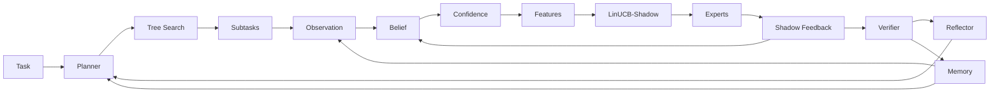

# ArcAsha Framework — Belief-Driven AI Orchestration

> 論文 (Zenodo 10.5281/zenodo.21755612) を凍結した後に、実験系列 (EXP-0000〜0003F) と
> 実装 (ArcAsha v0.1, `src/arcasha/`) を **数式レベルで統一** した理論ドキュメント。
>
> 部品集合ではなく、**Belief (状態推定) を中核に据えた AI オーケストレーションアーキテクチャ**
> としての一貫した設計原理を与えることを目的とする。

---

## 0. 統一根底原理 — Belief-Driven AI Orchestration

ArcAsha の全モジュールは、独立した部品ではなく **「Belief (状態推定)」を中核にした一つの実行系** として統合される。
**Observation は入力様式、Belief はその解釈**であり、Belief がすべての下流判断を駆動する:

| 判断 | Belief の使い方 | 対応モジュール | 実験的根拠 |
|------|----------------|----------------|-----------|
| **誰が解くか** (Routing) | capability μ を特徴量に組み込み LinUCB が重み学習 | `belief → features → LinUCB` | F: capability 除去で **+37.6%** |
| **どんなプランか** (Planning) | 有効能力 $\hat\mu$ でプランを事前評価し Beam 枝刈り | `estimate → beam → execute` | Tree Search (実機検証済み) |
| **何を思い出すか** (Memory) | 類似エピソードを検索し事前信念 $\mu_0$ を初期化 | `memory.search → planner` | Vector Memory (実機検証済み) |
| **どう改善するか** (Reflection) | 失敗サブタスクの信念 (μ, n) から原因診断 → 対処 | `verifier → reflector → planner` | Self Reflection (実機検証済み) |

統合パイプライン (§6) の Belief 中心の書き換え:

$$
\text{Belief} \to
\begin{cases}
\text{Routing: } & \hat e = \arg\max_{e \in \mathcal{E}} \;\theta_e^\top \phi_e(\mu_e, g_e) + \alpha\sqrt{\cdot} \\
\text{Planning: } & p^{*} = \arg\max_{p \in \text{Beam}} \;\text{Estimate}(\hat\mu;\, p) \\
\text{Memory: } & \mathcal{H}^{*} = \arg\max_{\mathcal{H}} \;\text{sim}\big(\text{emb}(T),\, \text{emb}(\mathcal{H})\big) \\
\text{Reflection: } & \text{remedy} = \mathcal{R}\big(\mu_{\hat e, c},\; n_{\hat e, c}\big)
\end{cases}
$$

この構図により ArcAsha は「ルーティングライブラリ」ではなく、
**Belief を中核に据えた AI オーケストレーションアーキテクチャ** として一貫した研究プログラムになる。

---

## 1. パイプライン全体像

```
      Task
        │
        ▼
    ┌─────────┐      ┌──────────────┐      ┌──────────────────┐
    │ Planner │ ───► │  Subtasks     │ ───► │ Tree Search      │  (探索: Plan A/B/C → Beam)
    └─────────┘      └──────┬───────┘      └──────────────────┘
                            ▼
   ┌──────────────────────────────────────────────┐
   │        ルーティングレベル (ステップ閉ループ)   │
   │                                              │
   │  Observation → Belief → Confidence → Features │
   │        → LinUCB-Shadow → Experts             │
   │              ↕ (Shadow Feedback)             │
   └──────────────────────┬───────────────────────┘
                          ▼
                    ┌──────────┐      ┌────────┐
                    │ Verifier │ ───► │ Memory │  (タスクレベル: EXP-0005D/E)
                    └────┬─────┘      └───┬────┘
                         │                │ (類似エピソード → Planner への帰還)
                         ▼                ▼
                  Self Reflection    Integrated Answer
                  (失敗原因 → 次プラン)
```



---

## 2. 記法 (Notation)

| 記号 | 意味 |
|---|---|
| $\mathcal{E} = \{e_1, \dots, e_K\}$ | エキスパート集合 (異種 LLM) |
| $\mathcal{C} = \{\text{coding}, \text{math}, \text{reasoning}\}$ | タスク能力 (種類) |
| $T_t = (c_t, p_t)$ | 時刻 $t$ のタスク (能力 $c_t$, プロンプト $p_t$) |
| $y_{e,t} = f_e(p_t)$ | エキスパート $e$ の出力 |
| $s_{e,t} = \mathcal{Q}_{c_t}(y_{e,t}) \in [0,1]$ | ルールベース評価スコア (品質) |
| $\ell_{e,t}$ | レイテンシ (EMA $\alpha=0.3$ で平滑化) |
| $m_e$ | パラメータ数 (EstimatedCost の proxy) |
| $\sigma_e \in [0,1]$ | 安定性 |
| $r_{e,t}$ | 多目的報酬 |
| $\rho_t$ | ステップ $t$ のリグレット |

---

## 3. 構成要素の形式的定義

### 3.1 Observation (観測)

タスク $T_t$ に対して全エキスパートを実行し、出力を評価する:

$$
s_{e,t} = \mathcal{Q}_{c_t}\big(f_e(p_t)\big), \quad \forall e \in \mathcal{E}
$$

**シャドウ実行 (Shadow)** では $\forall e$ について $s_{e,t}$ を観測する (**Full Information**)。
これは「選択したアームのみ観測」という部分情報バンディットの制約を明示的に外す設計である
(後述 P1, P2)。

### 3.2 Belief (ベイズ状態推定)

$(e, c)$ ペアごとに、観測列 $s^{(1)}, s^{(2)}, \dots$ から能力を推定する。
Beta-Bernoulli モデル (事前 $\text{Beta}(\alpha_0, \beta_0)$) の事後平均:

$$
\mu_{e,c}^{(n)} = \frac{\alpha_0 + \sum_{i=1}^{n} s_{e,c}^{(i)}}{\alpha_0 + \beta_0 + n}
$$

実装はこれと等価な再帰形 (running mean, $\mu_0 = 0.5$, $n_0 = 0$):

$$
\mu^{(n)} = \frac{(n-1)\,\mu^{(n-1)} + s^{(n)}}{n}, \qquad n \leftarrow n + 1
$$

状態推定としての役割 (EXP-0003A): ルーターは静的なプロファイルを持たず、
**観測から状態を推定する**。

### 3.3 Confidence (信頼度)

$$
g_{e,c}(n) = 1 - \exp\!\Big(-\frac{n}{\tau}\Big), \qquad \tau = 8
$$

解釈: 観測がレート $1/\tau$ の Poisson 過程で到着するとみなしたときの
「$n$ 回以上観測済み」の確率 = **知識の充足度**。
$g(0) = 0$, $g \to 1$ (単調増加)。

### 3.4 Effective Capability (有効能力)

$$
\hat\mu_{e,c} \;=\; \mu_{e,c} \cdot g_{e,c}(n)
$$

二段階信頼度加重 (EXP-0002D.1)。観測が少ない間は $\mu$ を過信せず、
スコア逆転 (Score Inversion) を回避する。

### 3.5 Feature Vector (特徴量, 8 次元)

$$
\phi_{e,t} = \Big[\,
\underbrace{1}_{\text{bias}},\;
\underbrace{\mu_{e,c_t}}_{\text{capability}},\;
\underbrace{1 - \tfrac{\ell_{e,t}}{L_{\max}}}_{\text{latency}},\;
\underbrace{1 - \tfrac{m_e}{M_{\max}}}_{\text{cost (Estimated)}},\;
\underbrace{\sigma_e}_{\text{stability}},\;
\underbrace{g_{e,c_t}(n)}_{\text{confidence}},\;
\underbrace{1 - \tfrac{M_e}{2}}_{\text{memory}},\;
\underbrace{1 - \theta_e}_{\text{temperature}}
\,\Big]^\top \in \mathbb{R}^{8}
$$

ここで $L_{\max} = \max_e \ell_{e,t}$, $M_{\max} = \max_e m_e$。
**capability と confidence は信念から導出**される動的特徴量である (EXP-0003C.4, F)。

### 3.6 LinUCB-Shadow Policy (EXP-0003C.4)

エキスパートごとの disjoint LinUCB (Li et al. 2010):

$$
A_{e,t} = \lambda I + \sum_{\tau < t} \phi_{e,\tau}\phi_{e,\tau}^{\top},
\qquad
b_{e,t} = \sum_{\tau < t} r_{e,\tau}\,\phi_{e,\tau},
\qquad
\theta_{e,t} = A_{e,t}^{-1}\,b_{e,t}
$$

選択:

$$
\hat{e}_t = \arg\max_{e \in \mathcal{E}}\;
\underbrace{\theta_{e,t}^{\top}\phi_{e,t}}_{\text{推定価値}}
\;+\;
\underbrace{\alpha \sqrt{\phi_{e,t}^{\top} A_{e,t}^{-1} \phi_{e,t}}}_{\text{不確実性ボーナス}}
$$

### 3.7 Shadow Feedback & Multi-Objective Reward

シャドウ評価により全アームの報酬が観測可能になる:

$$
r_{e,t} = w_Q\,s_{e,t}
+ w_{\ell}\Big(1 - \tfrac{\ell_{e,t}}{L_{\max}}\Big)
+ w_m\Big(1 - \tfrac{m_e}{M_{\max}}\Big)
+ w_{\sigma}\,\sigma_{e,t}
$$

実装値: $w_Q = 1.0$, $w_\ell = 0.10$, $w_m = 0.10$, $w_\sigma = 0.10$。

**オラクル** (品質基準): $e_t^{*} = \arg\max_{e} s_{e,t}$。
**リグレット**: $\rho_t = s_{e_t^{*},t} - s_{\hat{e}_t,t}$。

### 3.8 Planner / Verifier / Memory (タスクレベル閉ループ)

- **Planner** (EXP-0005A): 分解写像
  $$
  \mathcal{D}: T \mapsto (T_1, \dots, T_K), \quad T_i = (c_i, p_i, \text{role}_i)
  $$
- **Verifier** (EXP-0005D):
  $$
  V(T_i, y_i) = \mathbb{1}\big[\,s_i \ge \theta \;\wedge\; \neg\,\text{refusal}(y_i)\,\big], \quad \theta = 0.4
  $$
- **Memory** (EXP-0005E): エピソード蓄積
  $$
  \mathcal{H}_t = \big(T_t,\; \{(T_i,\ \hat{e}_i,\ y_i)\}_{i},\; Y_t^{\text{int}}\big)
  $$

---

## 4. 設計原理 (なぜこの設計なのか)

| # | 原理 | 実験的裏付け | 設計への反映 |
|---|------|------|------|
| **P1** | **フィードバック非対称性**: 学習器の不利は「手設計 vs 学習」ではなく「部分情報 vs フル情報」にある | C.2: Fixed の漸近指数 $b=0.75$ が最小 → 学習器は構造的に追い越せない ($N^* = \text{NEVER}$) | フル情報を第一原理として採用 |
| **P2** | **シャドウが情報構造を変える**: 部分情報 → フル情報の変換が決定的 | C.3: UCB のギャップ 94% 解消 (9.58→0.60), Thompson の $N^*$ が 6.2 倍高速化 | 全アーム毎ステップ評価 |
| **P3** | **特徴学習は手設計よりロバスト**: 環境に応じて重みを適応 | C.4: gemma の latency 重み 0.379 を学習 (>Fixed 0.20)。初めて Fixed を逆転 (gap −0.40) | LinUCB の $\theta$ をデータから学習 |
| **P4** | **capability 推定が支配的メカニズム**: 「観測→信念→能力推定」が LinUCB 優位の本質 | F: capability 除去で Regret **+37.6%** (p<0.001)。他特徴はほぼ無影響 | capability $\mu$ を第 2 特徴量に組み込み |
| **P5** | **統計検証と一般化**: 効果は検出力と品質分散に依存 | D: 30 seeds p=0.020 (10 seeds では p=0.77 非有意)。E: Set B で d=−0.88 に増大 | 30-seed 対応 Wilcoxon / Cohen's d の標準化 |

> **P4 はこのフレームワークの中心命題**である。LinUCB の優位は「探索アルゴリズムの賢さ」ではなく、
> 「信念からの能力推定を特徴量として使えること」に由来する (EXP-0003F)。

---

## 5. 統一命題 (Formal Propositions)

### Proposition 1 (情報構造の優位性)

> フル情報 (シャドウ) 下の学習器は、同一探索アルゴリズムの部分情報版を
> 期待リグレットの意味で **弱支配** する: $\mathbb{E}[\mathcal{R}^{\text{shadow}}] \le \mathbb{E}[\mathcal{R}^{\text{partial}}]$。

実験的証拠 (D): UCB-Shadow vs UCB-Partial で p<0.001, d=−1.10。
部分情報では 8 次元の線形モデル自体が学習不能 (LinUCB-Partial = UCB-Shadow と同値, C.4)。

### Proposition 2 (リグレット分解)

$\hat{v}_{e,t} = \theta_{e,t}^{\top}\phi_{e,t} + \alpha\sqrt{\phi_{e,t}^{\top} A_{e,t}^{-1}\phi_{e,t}}$ とすると:

$$
\rho_t
= \underbrace{\Big(s_{e_t^{*},t} - \max_{e}\hat{v}_{e,t}\Big)}_{\text{(A) 推定ギャップ}}
+ \underbrace{\Big(\max_{e}\hat{v}_{e,t} - s_{\hat{e}_t,t}\Big)}_{\text{(B) 選択ギャップ}}
$$

- **(A) 推定ギャップ**: 価値モデルの誤差。P4 より **capability 推定誤差が支配的**。
- **(B) 選択ギャップ**: 選択アームにおける楽観バイアス/モデル誤差。

シャドウは全 $e$ の $s_{e,t}$ を観測するため、**両者の学習信号に選択バイアスが入らない**。
これが Proposition 1 のメカニズムである。

### Proposition 3 (LinUCB の累積リグレスト上界)

線形実現可能性 (ある $\theta^{*}$ が存在して $r_{e,t} = \phi_{e,t}^{\top}\theta^{*} + \eta$)
のもとで、標準的な LinUCB は

$$
\mathcal{R}(T) = O\!\big(d\,\sqrt{T}\,\log T\big)
$$

ただし $d$ は特徴次元。**シャドウ変種**は選択アーム以外の更新も同時に行うため、
$d$ 次元モデルの学習に必要な観測が $K$ 倍効率で供給される (C.3 の $N^*$ 高速化と整合)。

### Proposition 4 (閉ループの成立条件)

タスクレベル閉ループ (Planner → Verifier → Memory) が機能するためには、
**サブタスク単位のルーティングが (A)+(B) を小さく保つ**こと。
ArcAsha v0.1 はこれを **Warmup (シャドウ学習)** で担保し、実行時に
$\hat{\mu}_{e,c}$ と $\theta_{e,t}$ を同時に学習する。

---

## 6. 統合パイプライン

ルーティングレベルは写像の合成として一意に書ける:

$$
\boxed{\;\text{Route} \;=\; \text{LinUCB} \circ \text{Features} \circ \text{Confidence} \circ \text{Belief} \circ \text{Observation} \circ \text{Shadow}\;}
$$

タスクレベル (Agentic 閉ループ):

$$
\boxed{\;\text{Answer} \;=\; \text{Integrate} \circ \text{Verifier} \circ \Big(\text{Route} \circ \text{Reflect} \circ \text{Search} \circ \text{Decompose}\Big)(T)\;}
$$

ここでの Planner は**その場でポリシーを生成する** (Emergent Policy) —
固定テーブルではなく、タスクごとに分解を決定し、Search が複数プランを探索し、
Reflect が失敗から自己改善する。**Belief はそのすべての判断を導く** (§0)。

---

## 7. 開かれた研究課題 (拡張)

| 拡張 | 内容 | 理論上の位置づけ | 状態 |
|------|------|------|:---:|
| **EXP-0005B** | LLM Planner: 分解自体を学習対象に | 分解の品質をタスクレベルリグレットで測る新指標が必要 | ✅ |
| **EXP-0005C** | Dynamic Expert Assignment: 何人/誰/並列/逐次の決定 | サブタスク数を $K$ 自体の最適化に拡張 | ✅ |
| **Vector Memory** | Embedding 検索で類似エピソードを取得し信念へ注入 | 事前信念 $\mu_0$ をエピソードから初期化 (転移学習) | ✅ (検索まで) |
| **Tree Search** | 複数プラン生成 → Beam (信念推定) → 実行 → Verifier 選抜 → 最弱展開 | プラン空間での探索を Policy 生成と分離。$\text{BestPlan} = \arg\max_{p\in\text{Beam}} \text{Verifier}(\text{Route}(p))$ | ✅ |
| **Self Reflection** | 失敗サブタスクの信念 (μ, n) から原因診断 → re-route / committee / re-decompose → 再実行 | 自己改善の判断に Belief を使用。$\text{remedy} = \mathcal{R}(\mu_{\hat e,c}, n_{\hat e,c})$ | ✅ |
| **Long-term Memory** | 検索エピソードから事前信念 $\mu_0$ を初期化 (転移学習) | Vector Memory を Planner の入力に接続 | 📐 |
| **MCTS** | PUCT でプラン空間を探索 (expand → rollout → backprop) | Beam を UCB/PUCT による探索に置換 | 📐 |
| **Multi-Agent Debate** | 専門エキスパート群による議論 → Verifier で統合 | topK committee の拡張 (対話型) | 📐 |

---

*ArcAsha v0.1 — Belief-Driven AI Orchestration. Paper: 10.5281/zenodo.21755612*
